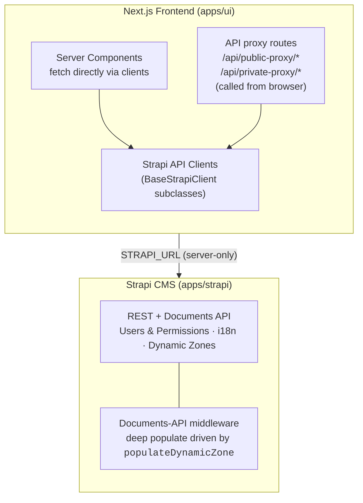
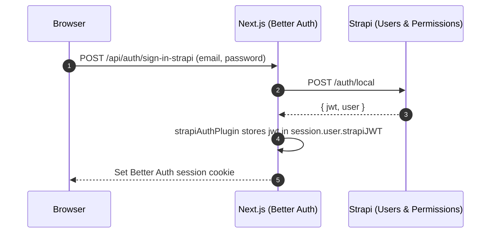

# Architecture

A factual map of how requests flow through the monorepo, where data lives, and which file does what. Every non-obvious claim links to source.

## Stack

| App           | Stack                                                                  | Entry                                                                                                                                     |
| ------------- | ---------------------------------------------------------------------- | ----------------------------------------------------------------------------------------------------------------------------------------- |
| `apps/strapi` | Strapi 5.46, Node 24, PostgreSQL (Docker) or SQLite                    | [src/index.ts](https://github.com/notum-cz/strapi-next-monorepo-starter/blob/main/apps/strapi/src/index.ts)                               |
| `apps/ui`     | Next.js 16 (App Router), React 19, Better Auth, next-intl, Tailwind v4 | [src/app/[locale]/layout.tsx](https://github.com/notum-cz/strapi-next-monorepo-starter/blob/main/apps/ui/src/app/%5Blocale%5D/layout.tsx) |
| `apps/docs`   | Docusaurus 3.10                                                        | [docusaurus.config.ts](https://github.com/notum-cz/strapi-next-monorepo-starter/blob/main/apps/docs/docusaurus.config.ts)                 |

Shared code lives in `packages/*` — see [Packages](./reference/packages.md).

## High-level Diagram



## Apps

| Path                                                                                          | Role                                                                                           |
| --------------------------------------------------------------------------------------------- | ---------------------------------------------------------------------------------------------- |
| [apps/strapi](https://github.com/notum-cz/strapi-next-monorepo-starter/tree/main/apps/strapi) | Headless CMS. Defines content types, components, dynamic zones, permissions. Exposes REST API. |
| [apps/ui](https://github.com/notum-cz/strapi-next-monorepo-starter/tree/main/apps/ui)         | Next.js frontend that renders pages built in Strapi.                                           |
| [apps/docs](https://github.com/notum-cz/strapi-next-monorepo-starter/tree/main/apps/docs)     | This site.                                                                                     |

## Request Lifecycle — Page Render

A request for `/<locale>/<path>` from the browser:

1. **App Router match.** Next.js routes to the catch-all [`src/app/[locale]/[[...rest]]/page.tsx`](https://github.com/notum-cz/strapi-next-monorepo-starter/blob/main/apps/ui/src/app/%5Blocale%5D/%5B%5B...rest%5D%5D/page.tsx). It joins `params.rest` with `ROOT_PAGE_PATH` (`"/"` from [`@repo/shared-data`](./reference/packages.md)) into a `fullPath`.
2. **Server fetch.** Calls [`fetchPage(fullPath, locale)`](https://github.com/notum-cz/strapi-next-monorepo-starter/blob/main/apps/ui/src/lib/strapi-api/content/server.ts) (a `"server-only"` module). It reads `draftMode()` and forwards `status: "draft" | "published"` plus `populateDynamicZone: { content: true }` to Strapi.
3. **Strapi client → REST.** Underneath, `PublicStrapiClient.fetchOneByFullPath("api::page.page", fullPath, ...)` issues `GET /pages?filters[fullPath][$eq]=...&locale=...&status=...&populateDynamicZone[content]=true`. The base class is in [`base.ts`](https://github.com/notum-cz/strapi-next-monorepo-starter/blob/main/apps/ui/src/lib/strapi-api/base.ts) and authorizes with `STRAPI_REST_READONLY_API_KEY` server-side.
4. **Document middleware on Strapi.** The middleware [`apps/strapi/src/documentMiddlewares/page.ts`](https://github.com/notum-cz/strapi-next-monorepo-starter/blob/main/apps/strapi/src/documentMiddlewares/page.ts) intercepts `findMany`/`findFirst`/`findOne`, reads the `populateDynamicZone` param, prefetches the page to discover which dynamic-zone components are actually present, then injects a precise `populate` tree built from [`src/populateDynamicZone/`](https://github.com/notum-cz/strapi-next-monorepo-starter/tree/main/apps/strapi/src/populateDynamicZone). This avoids manually maintaining a deep populate tree on the client.
5. **Render.** The page returns the dynamic zone array. The page component iterates `content`, looks each item's `__component` UID up in the `PageContentComponents` registry ([`page-builder/index.tsx`](https://github.com/notum-cz/strapi-next-monorepo-starter/blob/main/apps/ui/src/components/page-builder/index.tsx)), and renders inside an `ErrorBoundary`. See [Page Builder](./content-system/page-builder.md) for full mechanics.

The `page` collection itself is a hierarchy (parent/children with auto-computed `fullPath`). See [Pages Hierarchy](./content-system/pages-hierarchy.md).

## Strapi API Clients

Defined in [`apps/ui/src/lib/strapi-api/`](https://github.com/notum-cz/strapi-next-monorepo-starter/tree/main/apps/ui/src/lib/strapi-api).

| Class                 | Use case                                                 | Auth                                                                                                                                      | Notes                                                                                                                                                                                                     |
| --------------------- | -------------------------------------------------------- | ----------------------------------------------------------------------------------------------------------------------------------------- | --------------------------------------------------------------------------------------------------------------------------------------------------------------------------------------------------------- |
| `PublicStrapiClient`  | Anonymous reads / writes from server or browser          | Server: injects `STRAPI_REST_READONLY_API_KEY` (read) or `STRAPI_REST_CUSTOM_API_KEY` (write). Browser: goes through `/api/public-proxy`. | UID → path map in [`base.ts:17` `API_ENDPOINTS`](https://github.com/notum-cz/strapi-next-monorepo-starter/blob/main/apps/ui/src/lib/strapi-api/base.ts#L17). Extend it when adding content types.         |
| `PrivateStrapiClient` | Per-user reads/writes (e.g. `users/me`, account actions) | User's Strapi JWT from Better Auth session.                                                                                               | Resolved via [`request-auth.ts`](https://github.com/notum-cz/strapi-next-monorepo-starter/blob/main/apps/ui/src/lib/strapi-api/request-auth.ts) — server reads cookies, client calls `/api/auth/session`. |

Both expose typed helpers (`fetchOne`, `fetchMany`, `fetchAll`, `fetchOneBySlug`, `fetchOneByFullPath`) generic over `UID.ContentType` from [`@repo/strapi-types`](./reference/packages.md).

See [Strapi API Client](./content-system/strapi-api-client.md) for details.

## Proxy Routes

Two route handlers under [`apps/ui/src/app/api/`](https://github.com/notum-cz/strapi-next-monorepo-starter/tree/main/apps/ui/src/app/api):

| Route                          | Adds auth header?                                                                        | Purpose                                                                                                        |
| ------------------------------ | ---------------------------------------------------------------------------------------- | -------------------------------------------------------------------------------------------------------------- |
| `/api/public-proxy/[...slug]`  | Yes — `STRAPI_REST_READONLY_API_KEY` (GET/HEAD) or `STRAPI_REST_CUSTOM_API_KEY` (writes) | Hide Strapi URL **and** API token from the client bundle while still allowing browser to fetch public content. |
| `/api/private-proxy/[...slug]` | No — forwards the client's `Authorization` header (a Strapi JWT set by Better Auth)      | Hide Strapi URL only. Token is per-user; supplied by caller.                                                   |

Both are gated by an allow-list in [`request-auth.ts:3` `ALLOWED_STRAPI_ENDPOINTS`](https://github.com/notum-cz/strapi-next-monorepo-starter/blob/main/apps/ui/src/lib/strapi-api/request-auth.ts#L3). Requests to unlisted paths return `403`. **Extend the list when exposing a new endpoint to the browser.**

Default GET allow-list: `api/pages`, `api/footer`, `api/navbar`, `api/users/me`, `api/auth/local`. Default POST: `api/subscribers`, `api/auth/local/register`, `api/auth/forgot-password`, `api/auth/reset-password`, `api/auth/change-password`.

## Draft Mode & Preview

Strapi's admin panel ships a Preview button (configured in [`apps/strapi/config/admin.ts`](https://github.com/notum-cz/strapi-next-monorepo-starter/blob/main/apps/strapi/config/admin.ts)) that opens:

```
GET /api/preview?secret=$STRAPI_PREVIEW_SECRET&url=/<path>&status=draft|published&locale=<locale>
```

The route handler [`apps/ui/src/app/api/preview/route.ts`](https://github.com/notum-cz/strapi-next-monorepo-starter/blob/main/apps/ui/src/app/api/preview/route.ts):

1. Validates the secret against `STRAPI_PREVIEW_SECRET`.
2. Calls `draftMode().enable()` (or `.disable()`).
3. **Iframe workaround**: rewrites the `__prerender_bypass` cookie with `sameSite: "none"` so Strapi's iframe-embedded preview sees it. Without this, draft mode silently falls back to published content.
4. Redirects to the requested URL on the correct locale.

`fetchPage` then reads `draftMode().isEnabled` and sends `status: "draft"` to Strapi.

## Caching

Default fetch options live in [`base.ts:48`](https://github.com/notum-cz/strapi-next-monorepo-starter/blob/main/apps/ui/src/lib/strapi-api/base.ts#L48):

```ts
next: {
  revalidate: isDevelopment() ? 0 : 60
}
```

So production builds cache Strapi responses for 60 s by default per Next.js ISR; dev rebuilds on every request. Callers can override via `requestInit.next.revalidate`.

React Compiler is enabled in [`next.config.mjs`](https://github.com/notum-cz/strapi-next-monorepo-starter/blob/main/apps/ui/next.config.mjs) — memoization is handled by the compiler for most components.

## Authentication

Dual layer. Better Auth manages the session cookie; Strapi's Users-Permissions plugin issues a JWT that is stored inside that session and reused for every per-user Strapi call.



On every session read, [`strapiSessionPlugin`](https://github.com/notum-cz/strapi-next-monorepo-starter/blob/main/apps/ui/src/lib/auth.ts) re-validates the JWT against Strapi's `/users/me` and clears the cookie if the user is blocked or the JWT is invalid.

OAuth is wired via `strapiOAuthPlugin` (`/sync-oauth-strapi` endpoint) which exchanges a provider access token for a Strapi JWT.

See [Authentication](./auth/frontend/authentication.md).

## Internationalization

Two layers:

| Layer            | What                                               | Source                                                                                                                                                                                                                                                          |
| ---------------- | -------------------------------------------------- | --------------------------------------------------------------------------------------------------------------------------------------------------------------------------------------------------------------------------------------------------------------- |
| Frontend strings | next-intl, JSON message catalogs                   | [`apps/ui/locales/en.json`](https://github.com/notum-cz/strapi-next-monorepo-starter/blob/main/apps/ui/locales/en.json), [`cs.json`](https://github.com/notum-cz/strapi-next-monorepo-starter/blob/main/apps/ui/locales/cs.json)                                |
| Content          | Strapi i18n plugin; locale forwarded as `?locale=` | [`config/plugins.ts`](https://github.com/notum-cz/strapi-next-monorepo-starter/blob/main/apps/strapi/config/plugins.ts), [`content/server.ts`](https://github.com/notum-cz/strapi-next-monorepo-starter/blob/main/apps/ui/src/lib/strapi-api/content/server.ts) |

Routing config is in [`apps/ui/src/lib/navigation.ts`](https://github.com/notum-cz/strapi-next-monorepo-starter/blob/main/apps/ui/src/lib/navigation.ts):

```ts
defineRouting({
  locales: ["cs", "en"],
  defaultLocale: "en",
  localePrefix: "as-needed",
})
```

`as-needed` strips the locale segment for the default locale (so `/en/about` and `/about` both work; `/cs/o-nas` keeps the prefix).

Request-config loads the matching JSON in [`apps/ui/src/lib/i18n.ts`](https://github.com/notum-cz/strapi-next-monorepo-starter/blob/main/apps/ui/src/lib/i18n.ts). Time zone is hardcoded to `Europe/Prague`.

To add a locale, use the bundled skill or the [`add-locale`](https://github.com/notum-cz/strapi-next-monorepo-starter/tree/main/.agents/skills/add-locale) instructions.

## Environment Variables

Frontend env is validated at boot by [`@t3-oss/env-nextjs`](https://github.com/notum-cz/strapi-next-monorepo-starter/blob/main/apps/ui/src/env.mjs). Read at runtime via `getEnvVar()` from [`apps/ui/src/lib/env-vars.ts`](https://github.com/notum-cz/strapi-next-monorepo-starter/blob/main/apps/ui/src/lib/env-vars.ts).

Vars are intentionally **all optional** in the schema so Docker images can be built without baking secrets — runtime code must still check presence where it matters. See the JSDoc on `server` in [`env.mjs`](https://github.com/notum-cz/strapi-next-monorepo-starter/blob/main/apps/ui/src/env.mjs).

| Var                                                   | Scope  | Used by                                                              |
| ----------------------------------------------------- | ------ | -------------------------------------------------------------------- |
| `APP_PUBLIC_URL`                                      | server | Better Auth `baseURL`, URL formatting                                |
| `STRAPI_URL`                                          | server | Base URL for both clients and proxies                                |
| `STRAPI_REST_READONLY_API_KEY`                        | server | Public-proxy GET/HEAD auth; server-side reads                        |
| `STRAPI_REST_CUSTOM_API_KEY`                          | server | Public-proxy writes (POST etc.)                                      |
| `STRAPI_PREVIEW_SECRET`                               | server | Validates `/api/preview` requests from Strapi                        |
| `BETTER_AUTH_SECRET`                                  | server | Encrypts Better Auth session cookie                                  |
| `BASIC_AUTH_ENABLED`/`USERNAME`/`PASSWORD`            | server | Edge basic auth gate (staging)                                       |
| `IMGPROXY_URL`                                        | server | External image optimization service                                  |
| `RECAPTCHA_SECRET_KEY`                                | server | reCAPTCHA v3 verification                                            |
| `SENTRY_AUTH_TOKEN` / `SENTRY_ORG` / `SENTRY_PROJECT` | server | Source-map upload at build time                                      |
| `DEBUG_STRAPI_CLIENT_API_CALLS`                       | server | Verbose client logging                                               |
| `NEXT_OUTPUT`                                         | server | Set to `export` for static build                                     |
| `NEXT_PUBLIC_SENTRY_DSN`                              | client | Sentry browser SDK                                                   |
| `NEXT_PUBLIC_RECAPTCHA_SITE_KEY`                      | client | reCAPTCHA widget                                                     |
| `NEXT_PUBLIC_PREVENT_UNUSED_FUNCTIONS_ERROR_LOGS`     | client | Sentry noise filter                                                  |
| `NODE_ENV`, `APP_ENV`                                 | shared | `APP_ENV` distinguishes `testing`/`production` for deployment splits |

Strapi-side vars (database, JWT, SSO, providers) are read inside [`apps/strapi/config/*`](https://github.com/notum-cz/strapi-next-monorepo-starter/tree/main/apps/strapi/config); see the [`apps/strapi/.env.example`](https://github.com/notum-cz/strapi-next-monorepo-starter/blob/main/apps/strapi/.env.example) for the full list.

Seed automation env: `AUTO_SEED_ENABLED`, `AUTO_SEED_MODE` — see [Data Seeding](./strapi/data-seeding.md).

## Pages Hierarchy

Pages are a parent/child tree. `fullPath` is the cached, denormalized slug chain that the catch-all route filters by. See [Pages Hierarchy](./content-system/pages-hierarchy.md).

## Tests

| App           | Runner                                            | Location                                                                                                                                                                         |
| ------------- | ------------------------------------------------- | -------------------------------------------------------------------------------------------------------------------------------------------------------------------------------- |
| `apps/strapi` | Vitest, node env, 30 s timeout                    | [`apps/strapi/tests/`](https://github.com/notum-cz/strapi-next-monorepo-starter/tree/main/apps/strapi/tests)                                                                     |
| `apps/ui`     | Vitest                                            | [`apps/ui/src/lib/__tests__/`](https://github.com/notum-cz/strapi-next-monorepo-starter/tree/main/apps/ui/src/lib/__tests__)                                                     |
| QA            | Playwright (E2E, SEO, visual), Lighthouse-CI, axe | [`qa/`](https://github.com/notum-cz/strapi-next-monorepo-starter/tree/main/qa) (see [turbo.json](https://github.com/notum-cz/strapi-next-monorepo-starter/blob/main/turbo.json)) |

## Related Documentation

- [Authentication](./auth/frontend/authentication.md) — Better Auth + Strapi JWT details
- [Strapi API Client](./content-system/strapi-api-client.md) — client surface and proxy mechanics
- [Page Builder](./content-system/page-builder.md) — dynamic-zone → React component mapping
- [Add a Content Type](./getting-started/add-content-type.md) — end-to-end workflow for a new collection
- [Packages](./reference/packages.md) — shared `packages/*` reference
- [Pages Hierarchy](./content-system/pages-hierarchy.md) — slug/fullPath tree
- [Data Seeding](./strapi/data-seeding.md) — seed export + auto-import on dev start
