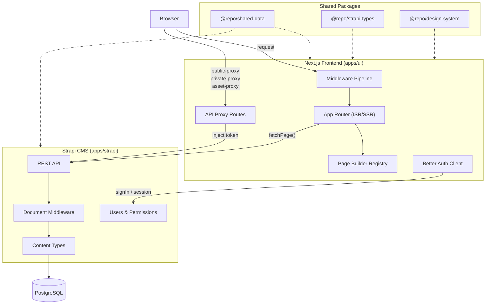
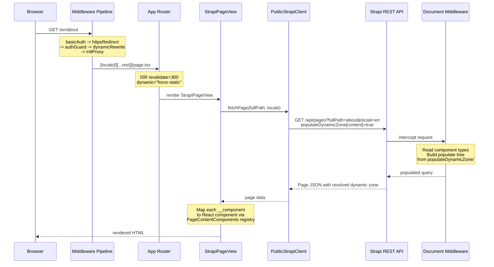
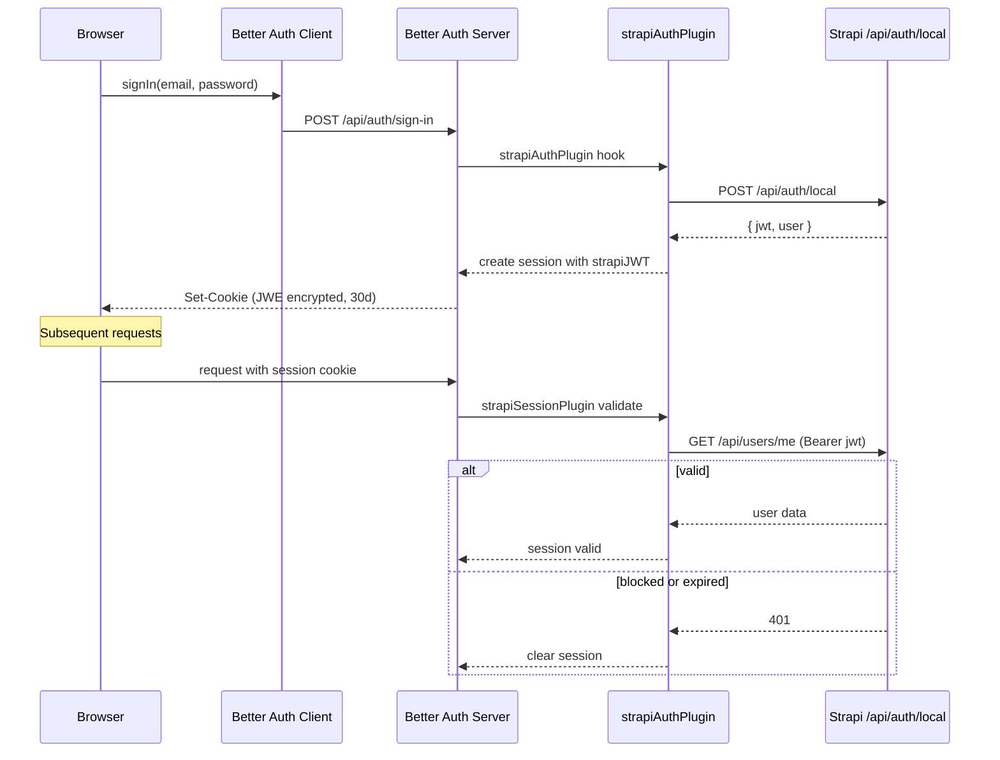
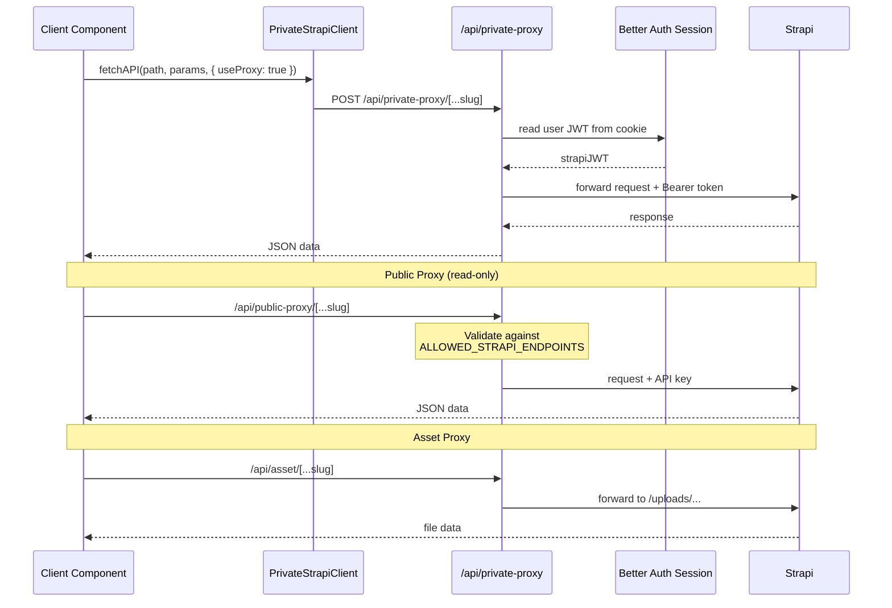

# Architecture Overview

## System Overview

| Layer            | Location       | Responsibility                                                     |
| ---------------- | -------------- | ------------------------------------------------------------------ |
| Strapi CMS       | `apps/strapi/` | Content management, REST API, user authentication, media storage   |
| Next.js Frontend | `apps/ui/`     | SSR/ISR rendering, middleware pipeline, page builder, auth session |
| Shared Packages  | `packages/`    | Path utilities, type definitions, design tokens, tooling configs   |

:::note
Next.js never exposes the Strapi URL to the browser. All client-side requests go through proxy routes (`/api/public-proxy`, `/api/private-proxy`, `/api/asset`).
:::

## Page Request Flow

**Middleware pipeline** runs on every request in order: `basicAuth` -> `httpsRedirect` -> `authGuard` -> `dynamicRewrite` -> `intlProxy`. Defined in `apps/ui/src/proxy.ts`.

**Dynamic page variant:** When the URL has search params (e.g., `/en/search?q=foo`), `dynamicRewrite` rewrites to `/[locale]/dynamic/[[...rest]]/page.tsx` with `dynamic="force-dynamic"` for SSR on every request.

:::tip
The `populateDynamicZone` system keeps populate trees out of frontend code. Add a new component populate config in `apps/strapi/src/populateDynamicZone/{category}/` and it auto-discovers.
:::

## Auth Flow

| Concern           | Implementation                                                   |
| ----------------- | ---------------------------------------------------------------- |
| Session layer     | Better Auth (cookies, JWE encrypted, stateless)                  |
| Identity provider | Strapi users-permissions plugin                                  |
| JWT storage       | `user.strapiJWT` in session cookie                               |
| SSR access        | `getSessionSSR(headers())` from `apps/ui/src/lib/auth.ts`        |
| CSR access        | `getSessionCSR()` from `apps/ui/src/lib/auth-client.ts`          |
| Route protection  | `authGuard` middleware in `apps/ui/src/lib/proxies/authGuard.ts` |

## Proxy Flow

| Proxy Route                    | Auth Method           | Use Case                                        |
| ------------------------------ | --------------------- | ----------------------------------------------- |
| `/api/public-proxy/[...slug]`  | Read-only API key     | Public content from client components           |
| `/api/private-proxy/[...slug]` | User JWT from session | Authenticated actions from client components    |
| `/api/asset/[...slug]`         | None (passthrough)    | Strapi media files without exposing backend URL |

:::warning
The public proxy validates each endpoint against `ALLOWED_STRAPI_ENDPOINTS` in `apps/ui/src/lib/strapi-api/request-auth.ts`. Requests to unlisted endpoints are rejected.
:::

## Page Builder

Strapi component UIDs map to React components via a central registry.

- Strapi: Dynamic zone components in `apps/strapi/src/components/{category}/`
- Next.js: React components in `apps/ui/src/components/page-builder/components/{category}/`
- Registry: `apps/ui/src/components/page-builder/index.tsx`

See [Page Builder](./page-builder.md) for details.

## Strapi API Clients

Two client classes handle content fetching:

| Client                | Auth     | Use Case                                    |
| --------------------- | -------- | ------------------------------------------- |
| `PublicStrapiClient`  | API key  | Read-only content (server components, ISR)  |
| `PrivateStrapiClient` | User JWT | Authenticated endpoints (client components) |

Both extend `BaseStrapiClient` (`apps/ui/src/lib/strapi-api/base.ts`) which provides `fetchOne`, `fetchMany`, `fetchAll`, `fetchOneBySlug`, and `fetchOneByFullPath`.

See [Strapi API Client](../frontend/api-client.md) for details.

## Routing

- Catch-all `[locale]/[[...rest]]` renders Strapi-managed pages (ISR, revalidate=300)
- `[locale]/dynamic/[[...rest]]` handles pages with searchParams (SSR per request)
- Auth pages under `[locale]/auth/`
- Locale extracted from URL via `next-intl`, passed to API queries

## Internationalization

| System      | Purpose    | Location                        |
| ----------- | ---------- | ------------------------------- |
| next-intl   | UI strings | `apps/ui/locales/{locale}.json` |
| Strapi i18n | Content    | `locale` query parameter        |

Locales: `en` (default, no prefix), `cs`. Configured as `"as-needed"` prefix strategy in `apps/ui/src/lib/navigation.ts`.

## Authentication

- **Better Auth v1**: Session management (cookies, JWE encrypted, 30-day max age)
- **Strapi JWT**: Stored in session as `user.strapiJWT`, used for private API calls
- **strapiAuthPlugin**: Bridges Better Auth with Strapi's users-permissions (`apps/ui/src/lib/auth.ts`)

See the [Auth Flow diagram](#auth-flow) above for the complete sequence.

## Environment Variables

Validated via `@t3-oss/env-nextjs`. Access through `getEnvVar()`. Client-side vars injected via `window.CSR_CONFIG`.

Files bootstrapped from `.example` files on `pnpm install`.

## Pages Hierarchy

Pages use parent-child relations for URL structure. `fullPath` auto-generated from slug chain via lifecycle hooks in `apps/strapi/src/utils/hierarchy/`.

See [Pages Hierarchy](../backend/pages-hierarchy.md) for workflow.
