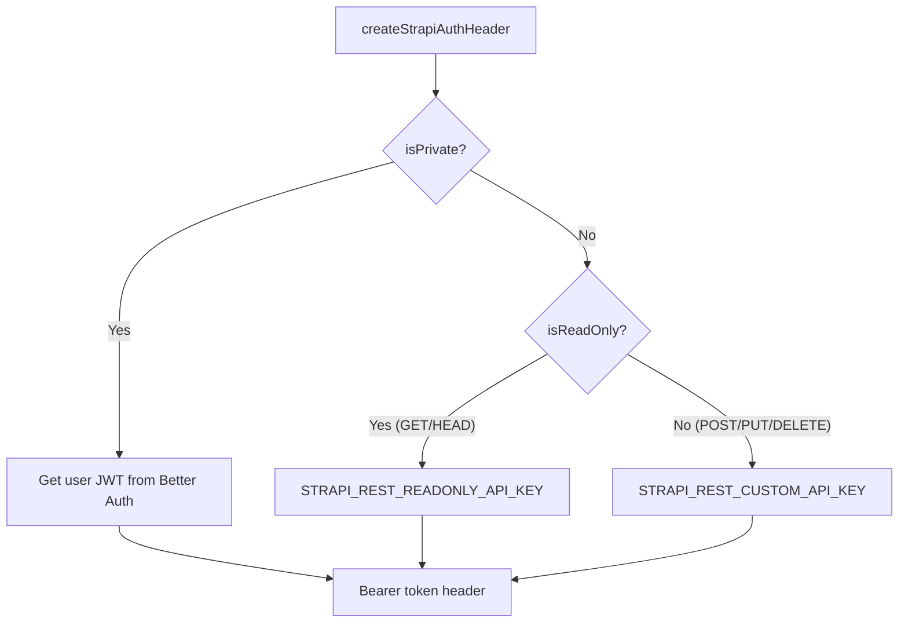
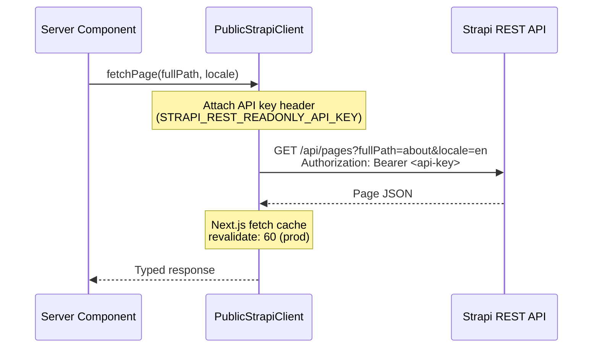
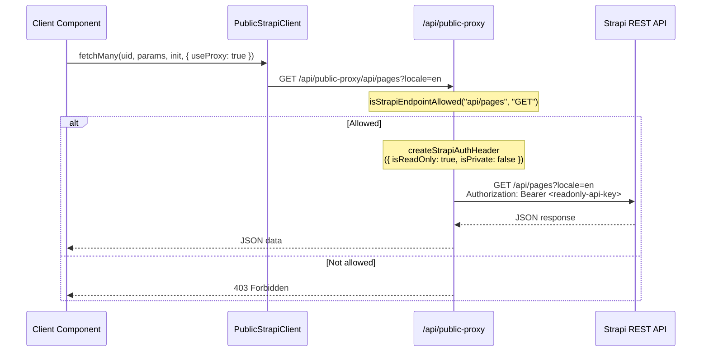
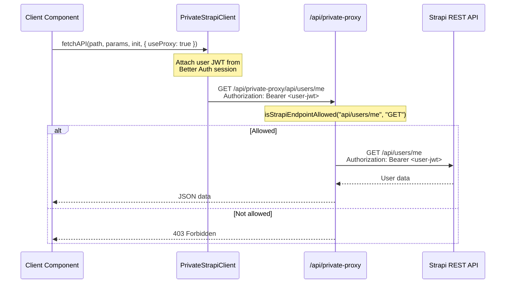
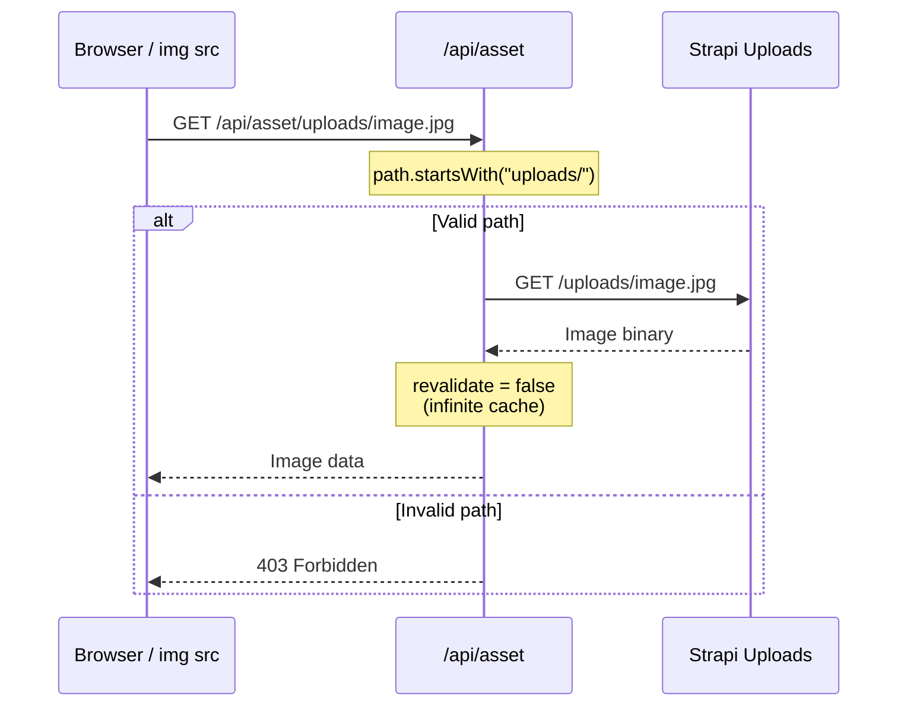

# Communication Between Layers

This page is the single source of truth for how Next.js talks to Strapi. It covers every communication path, the proxy system that hides the backend from browsers, token selection logic, and the endpoint allowlist. For the system-level architecture see [Architecture Overview](./architecture.md).

## Communication Paths Overview

| Path              | When Used                                          | Auth Method                              | Route / Code Path                       |
| ----------------- | -------------------------------------------------- | ---------------------------------------- | --------------------------------------- |
| SSR direct call   | Server components fetching page/navbar/footer data | API key (`STRAPI_REST_READONLY_API_KEY`) | `PublicStrapiClient` -> Strapi REST API |
| CSR public proxy  | Client components reading public content           | API key (injected by proxy)              | `/api/public-proxy/[...slug]`           |
| CSR private proxy | Client components making authenticated requests    | User JWT (passed through from client)    | `/api/private-proxy/[...slug]`          |
| Asset proxy       | Client components loading Strapi media             | None (passthrough)                       | `/api/asset/[...slug]`                  |

:::note
The browser never knows the Strapi URL or API tokens. All client-side requests route through Next.js proxy routes.
:::

## SSR Direct Call

Server components call Strapi directly using `PublicStrapiClient`. The API key is injected server-side. A `server-only` import guard prevents these fetchers from being imported in client components.

```typescript title="apps/ui/src/lib/strapi-api/content/server.ts"
import "server-only"

export async function fetchPage(
  fullPath: string,
  locale: Locale,
  requestInit?: RequestInit,
  options?: CustomFetchOptions
) {
  const dm = await draftMode()

  try {
    return await PublicStrapiClient.fetchOneByFullPath(
      "api::page.page",
      fullPath,
      {
        locale,
        status: dm.isEnabled ? "draft" : "published",
        populate: { seo: seoPopulate },
        populateDynamicZone: { content: true },
      },
      requestInit,
      options
    )
  } catch (e: unknown) {
    logNonBlockingError({
      message: `Error fetching page '${fullPath}' for locale '${locale}'`,
      error: {
        error: e instanceof Error ? e.message : String(e),
        stack: e instanceof Error ? e.stack : undefined,
      },
    })
  }
}
```

**Caching behavior:** `BaseStrapiClient.fetchAPI` sets `revalidate: 60` in production (60-second Next.js fetch cache) and `revalidate: 0` (no cache) in development:

```typescript title="apps/ui/src/lib/strapi-api/base.ts"
const response = await fetch(url, {
  ...requestInit,
  next: {
    ...requestInit?.next,
    revalidate: isDevelopment() ? 0 : (requestInit?.next?.revalidate ?? 60),
  },
  headers: {
    ...requestInit?.headers,
    ...headers,
  },
})
```

This is the preferred path for page data. Server components should always use direct calls rather than proxies.

## CSR via Public Proxy

Client components use `PublicStrapiClient` with `{ useProxy: true }`. Requests route through the `/api/public-proxy/[...slug]` handler, which validates the endpoint against the allowlist and injects the API token.

```typescript title="apps/ui/src/app/api/public-proxy/[...slug]/route.ts"
async function handler(
  request: Request,
  { params }: { params: Promise<{ slug: string[] }> }
) {
  const { slug } = await params
  const path = Array.isArray(slug) ? slug.join("/") : slug

  const isAccessible = isStrapiEndpointAllowed(path, request.method)
  if (!isAccessible) {
    return NextResponse.json(
      {
        error: {
          message: `Path '${path}' is not accessible`,
          name: "Forbidden",
        },
      },
      { status: 403 }
    )
  }

  const strapiUrl = getEnvVar("STRAPI_URL", true)
  const { search } = new URL(request.url)
  const url = `${strapiUrl!}/${path}${search ?? ""}`
  const isReadOnly = request.method === "GET" || request.method === "HEAD"

  const clonedRequest = request.clone()
  let body: string | Blob | undefined
  if (!isReadOnly) {
    const contentType = clonedRequest.headers.get("content-type")
    if (contentType?.includes("multipart/form-data")) {
      body = await clonedRequest.blob()
    } else {
      body = await clonedRequest.text()
    }
  }

  const authHeader = await createStrapiAuthHeader({
    isReadOnly,
    isPrivate: false,
  })

  const response = await fetch(url, {
    headers: {
      ...Object.fromEntries(clonedRequest.headers),
      ...authHeader,
    },
    body,
    method: request.method,
  })

  const headers = new Headers(response.headers)
  headers.delete("content-encoding")
  headers.delete("content-length")

  return new NextResponse(response.body, {
    status: response.status,
    headers,
  })
}

export {
  handler as DELETE,
  handler as GET,
  handler as HEAD,
  handler as POST,
  handler as PUT,
}
```

**How the `PublicClient` selects proxy vs direct:**

```typescript title="apps/ui/src/lib/strapi-api/public.ts"
if (options?.useProxy) {
  // Client-side: route through Next.js proxy
  completeUrl = `/api/public-proxy${url}`
} else {
  // Server-side: call Strapi directly with API key
  const strapiUrl = getEnvVar("STRAPI_URL", true)
  completeUrl = `${strapiUrl!}${url}`

  const isReadOnly = ["GET", "HEAD"].includes(requestInit?.method ?? "GET")
  const authHeader = await createStrapiAuthHeader({
    isReadOnly,
    isPrivate: false,
  })
  headers = { ...authHeader }
}
```

## CSR via Private Proxy

Client components use `PrivateStrapiClient` for authenticated requests. The private proxy passes through the user's `Authorization` header (containing the Strapi JWT from Better Auth session) rather than injecting an API key.

```typescript title="apps/ui/src/app/api/private-proxy/[...slug]/route.ts"
async function handler(
  request: Request,
  { params }: { params: Promise<{ slug: string[] }> }
) {
  const { slug } = await params
  const path = Array.isArray(slug) ? slug.join("/") : slug

  const isAccessible = isStrapiEndpointAllowed(path, request.method)
  if (!isAccessible) {
    return NextResponse.json(
      {
        error: {
          message: `Path '${path}' is not accessible`,
          name: "Forbidden",
        },
      },
      { status: 403 }
    )
  }

  const isReadOnly = request.method === "GET" || request.method === "HEAD"
  const { search } = new URL(request.url)
  const strapiUrl = getEnvVar("STRAPI_URL", true)
  const url = `${strapiUrl!}/${path}${search ?? ""}`

  const clonedRequest = request.clone()
  let body: string | Blob | undefined
  if (!isReadOnly) {
    const contentType = clonedRequest.headers.get("content-type")
    if (contentType?.includes("multipart/form-data")) {
      body = await clonedRequest.blob()
    } else {
      body = await clonedRequest.text()
    }
  }

  const response = await fetch(url, {
    headers: {
      ...Object.fromEntries(clonedRequest.headers),
    },
    body,
    method: request.method,
  })

  const headers = new Headers(response.headers)
  headers.delete("content-encoding")
  headers.delete("content-length")

  return new NextResponse(response.body, {
    status: response.status,
    headers,
  })
}

export {
  handler as DELETE,
  handler as GET,
  handler as HEAD,
  handler as POST,
  handler as PUT,
}
```

The key difference from the public proxy: the private proxy does **not** inject a token. It forwards the client's existing `Authorization` header, which contains the user JWT from Better Auth.

## Asset Proxy

The `/api/asset/[...slug]` route proxies Strapi media files. It only allows paths under `uploads/` and uses `revalidate = false` for infinite caching (upload files are immutable).

```typescript title="apps/ui/src/app/api/asset/[...slug]/route.ts"
export const revalidate = false

async function handler(
  request: Request,
  { params }: { params: Promise<{ slug: string[] }> }
) {
  const { slug } = await params
  const path = Array.isArray(slug) ? slug.join("/") : slug

  if (!path.startsWith("uploads/")) {
    return NextResponse.json(
      {
        error: {
          message: `Access denied: Only paths under uploads/ are allowed`,
          name: "Forbidden",
        },
      },
      { status: 403 }
    )
  }

  const strapiUrl = getEnvVar("STRAPI_URL", true)
  const url = `${strapiUrl!}/${path}`
  const clonedRequest = request.clone()

  const { url: _, ...rest } = clonedRequest
  const response = await fetch(url, { ...rest })

  return response
}

export { handler as GET }
```

The asset proxy is GET-only. No auth headers are needed because Strapi serves uploads publicly.

## Token Selection Logic

The `createStrapiAuthHeader` function in `request-auth.ts` decides which token to use based on the request type:

```typescript title="apps/ui/src/lib/strapi-api/request-auth.ts"
export const createStrapiAuthHeader = async ({
  isReadOnly,
  isPrivate,
}: {
  isReadOnly?: boolean
  isPrivate: boolean
}) => {
  if (isPrivate) {
    const userToken = await getStrapiUserTokenFromBetterAuth()
    return formatStrapiAuthorizationHeader(userToken)
  }

  const apiToken = isReadOnly
    ? getEnvVar("STRAPI_REST_READONLY_API_KEY")
    : getEnvVar("STRAPI_REST_CUSTOM_API_KEY")

  return formatStrapiAuthorizationHeader(apiToken)
}
```

| Condition                           | Token            | Source                                 |
| ----------------------------------- | ---------------- | -------------------------------------- |
| Private request (`isPrivate: true`) | User JWT         | Better Auth session (`strapiJWT`)      |
| Public read-only (GET/HEAD)         | Readonly API key | `STRAPI_REST_READONLY_API_KEY` env var |
| Public write (POST/PUT/DELETE)      | Custom API key   | `STRAPI_REST_CUSTOM_API_KEY` env var   |



The user JWT retrieval is environment-aware:

```typescript title="apps/ui/src/lib/strapi-api/request-auth.ts"
const getStrapiUserTokenFromBetterAuth = async () => {
  const isRSC = typeof window === "undefined"

  if (isRSC) {
    // Server side: Read session directly from cookies (no HTTP request)
    const { headers } = await import("next/headers")
    const { getSessionSSR } = await import("@/lib/auth")
    const session = await getSessionSSR(await headers())
    return session?.user?.strapiJWT
  }

  // Client side: Make HTTP request to /api/auth/session
  const { getSessionCSR } = await import("@/lib/auth-client")
  const { data: session } = await getSessionCSR()
  return session?.user?.strapiJWT
}
```

## Endpoint Allowlist

Both proxy routes validate incoming requests against `ALLOWED_STRAPI_ENDPOINTS` using prefix-based `startsWith` matching:

```typescript title="apps/ui/src/lib/strapi-api/request-auth.ts"
const ALLOWED_STRAPI_ENDPOINTS: Record<string, string[]> = {
  GET: [
    "api/pages",
    "api/footer",
    "api/navbar",
    "api/users/me",
    "api/auth/local",
  ],
  POST: [
    "api/subscribers",
    "api/auth/local/register",
    "api/auth/forgot-password",
    "api/auth/reset-password",
    "api/auth/change-password",
  ],
}

export const isStrapiEndpointAllowed = (
  path: string,
  method: string
): boolean => {
  return (
    ALLOWED_STRAPI_ENDPOINTS[method]?.some((endpoint) =>
      path.startsWith(endpoint)
    ) ?? false
  )
}
```

Requests to endpoints not in the list return `403 Forbidden`. The matching is prefix-based: `api/pages` allows `api/pages`, `api/pages/abc123`, `api/pages?locale=en`, etc.

:::tip[Adding a new endpoint]
Two steps are required when adding a new Strapi content type that the frontend queries:

1. Add the UID-to-path mapping in `API_ENDPOINTS` (`apps/ui/src/lib/strapi-api/base.ts`)
2. Add the path prefix to `ALLOWED_STRAPI_ENDPOINTS` (`apps/ui/src/lib/strapi-api/request-auth.ts`)

Missing step 1 causes a runtime error in the client. Missing step 2 causes a `403` from the proxy. See [Strapi API Client -- Adding New Endpoints](../frontend/api-client.md#adding-new-endpoints) for details.
:::

## Request Flow Diagrams

### SSR Direct Call



### CSR via Public Proxy



### CSR via Private Proxy



### Asset Proxy



## Related Documentation

- [Architecture Overview](./architecture.md) -- system-level diagrams and layer descriptions
- [Strapi API Client](../frontend/api-client.md) -- client class usage, fetch methods, and adding new endpoints
- [Page Builder](./page-builder.md) -- how fetched content is rendered into components
- [Rendering & Composition](./rendering-composition.md) -- ISR/SSR/CSR modes and server/client component boundaries
