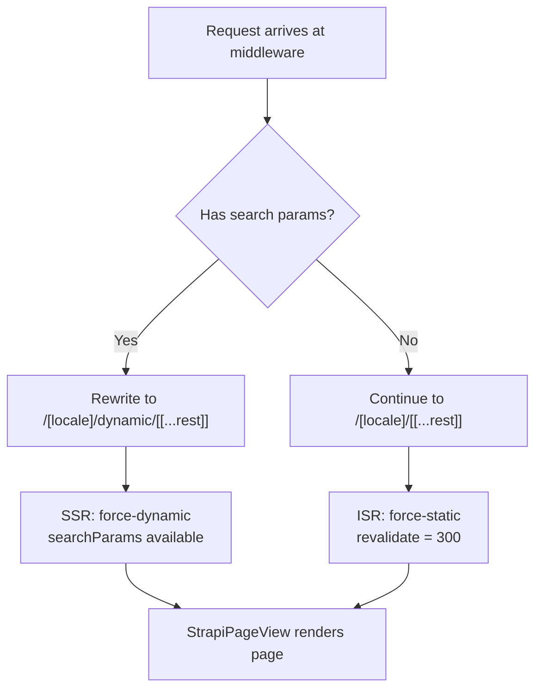

# Rendering & Composition Patterns

This page explains which rendering mode applies to each page and why, how the middleware selects between static and dynamic routes, and where `"use client"` boundaries live. For the system-level architecture overview see [Architecture Overview](./architecture.md).

## Rendering Modes

| Aspect            | ISR (Static + Revalidation)                                   | SSR (Dynamic per Request)                      | CSR (Client-Side)                 |
| ----------------- | ------------------------------------------------------------- | ---------------------------------------------- | --------------------------------- |
| **Route**         | `[locale]/[[...rest]]`                                        | `[locale]/dynamic/[[...rest]]`                 | Client components                 |
| **Config**        | `force-static`, `revalidate=300`                              | `force-dynamic`                                | N/A                               |
| **When**          | Default for all CMS pages                                     | Middleware rewrites when URL has search params | Interactive leaves (forms, menus) |
| **Caching**       | Built on first request, revalidated in background every 5 min | Fresh server render every request              | Browser-only, no server cache     |
| **searchParams**  | Not available                                                 | Available                                      | Available                         |
| **Auth (server)** | `headers()` returns empty -- session is `null`                | Full access to `headers()` and cookies         | N/A (uses client session)         |

## ISR (Static with Revalidation)

The catch-all route serves every CMS-managed page as a static page with [Incremental Static Regeneration](https://nextjs.org/docs/app/guides/incremental-static-regeneration).

```typescript title="apps/ui/src/app/[locale]/[[...rest]]/page.tsx"
export const dynamic = "force-static"

// Set ISR revalidation interval: regenerate the page every 5 minutes (300s)
export const revalidate = 300

// Enable ISR generation for pages not returned by generateStaticParams
// First request will SSR the page, then cache it for future requests
export const dynamicParams = true
```

**How it works:**

1. At build time, `generateStaticParams` fetches all pages from Strapi and pre-renders them.
2. On the first request after deployment, any page not in `generateStaticParams` is server-rendered and then cached.
3. Every 300 seconds, a background revalidation re-renders the page from fresh Strapi data.
4. Users always see the cached version while revalidation happens in the background.

`dynamicParams = true` ensures pages created in Strapi after deployment still work -- they are rendered on first request and cached from then on.

:::info[Route segment config]
`force-static` tells Next.js to treat this route as fully static. Any dynamic API (`headers()`, `cookies()`, `searchParams`) is silently ignored rather than throwing. See [route segment config](https://nextjs.org/docs/app/api-reference/file-conventions/route-segment-config#dynamic) for all options.
:::

## SSR (Dynamic per Request)

When a page needs runtime context (search params, preview mode), the dynamic handler takes over.

```typescript title="apps/ui/src/app/[locale]/dynamic/[[...rest]]/page.tsx"
// Force dynamic rendering (SSR) for this route
export const dynamic = "force-dynamic"

export default function DynamicStrapiPage(
  props: PageProps<"/[locale]/dynamic/[[...rest]]">
) {
  const params = use(props.params)
  // This is a dynamic page, so searchParams are available at runtime
  // and can be accessed here
  const searchParams = use(props.searchParams)

  return <StrapiPageView params={params} searchParams={searchParams} />
}
```

Both the static and dynamic handlers delegate to the same `StrapiPageView` component. The only difference is the rendering strategy and access to `searchParams`.

## CSR (Client-Side)

Client components fetch data through Next.js proxy routes using `{ useProxy: true }`. The browser never contacts Strapi directly.

```typescript
// Client component fetching via public proxy
const data = await PublicStrapiClient.fetchMany(
  "api::page.page",
  { locale: "en" },
  undefined,
  { useProxy: true }
)
```

CSR is used for interactive features (forms, auth UI, search results) where data depends on user input or session state. The proxy system is covered in depth in [Communication Between Layers](pathname://./communication.md).

## The dynamicRewrite Trick

The project has two catch-all routes that render identical content. Middleware transparently rewrites requests to the correct one based on whether search params are present. The URL bar never shows `/dynamic/`.



The `dynamicRewrite` middleware performs the URL rewrite:

```typescript title="apps/ui/src/lib/proxies/dynamicRewrite.ts"
export const dynamicRewrite = (
  req: NextRequest,
  intlProxy: (req: NextRequest) => NextResponse
): NextResponse | null => {
  const { pathname, search } = req.nextUrl

  const pathWithoutLocale = stripLocalePrefix(pathname)

  // Block direct access to the bare /dynamic path
  const dynamicPathRegex = new RegExp(
    `^/(?:${routing.locales.join("|")}/)?${dynamicPrefix}$`
  )
  if (dynamicPathRegex.test(pathname)) {
    return NextResponse.rewrite(new URL("/not-found", req.url))
  }

  // No rewrite needed for ignored paths or requests without search params
  if (
    ignoredPaths.some((path) => pathWithoutLocale.startsWith(path)) ||
    !search
  ) {
    return null
  }

  const parts = pathname.split("/").filter(Boolean)
  const hasLocale =
    parts.length >= 1 && routing.locales.includes(parts[0] as Locale)
  const locale = hasLocale ? parts[0] : routing.defaultLocale
  const rest = parts.slice(hasLocale ? 1 : 0).join("/")

  if (rest.startsWith(dynamicPrefix)) {
    return null
  }

  const rewriteUrl = new URL(
    [locale, dynamicPrefix, rest].filter(Boolean).join("/"),
    req.url
  )
  rewriteUrl.search = search

  const rewriteResponse = NextResponse.rewrite(rewriteUrl, intlProxy(req))
  rewriteResponse.headers.set("x-original-path", pathname)

  return rewriteResponse
}
```

**Key points:**

- `/en/search?q=foo` is internally rewritten to `/en/dynamic/search?q=foo` -- the user never sees `/dynamic/` in their browser.
- Direct navigation to `/en/dynamic` returns a 404.
- Paths starting with `/api`, `/dev`, or `/auth` are excluded from rewriting.
- The middleware runs as part of the pipeline defined in `apps/ui/src/proxy.ts`: `basicAuth` -> `httpsRedirect` -> `authGuard` -> `dynamicRewrite` -> `intlProxy`.

## Server vs Client Components

The project follows a **server-first, client at leaf** pattern. Page-level components (layout, page builder, navbar fetcher) are server components. Client components are limited to interactive leaves.

| Component           | Type   | Why                                                      |
| ------------------- | ------ | -------------------------------------------------------- |
| `StrapiPageView`    | Server | Orchestrates page render, calls Strapi directly          |
| `StrapiNavbar`      | Server | Fetches navbar data from Strapi, passes session to child |
| `NavbarAuthSection` | Client | Interactive auth state, `useSession()` hook              |
| `ClientProviders`   | Client | ThemeProvider, QueryClientProvider, Zod translations     |
| `ServerProviders`   | Server | NextIntlClientProvider (i18n)                            |
| `ErrorBoundary`     | Client | Uses `componentDidCatch` (React class API)               |
| Form components     | Client | Use hooks for form state (`useForm`, `useContactForm`)   |
| UI primitives       | Client | Use DOM APIs (accordion, carousel, dialog)               |

The `StrapiNavbar` -> `NavbarAuthSection` boundary illustrates the pattern:

```typescript title="apps/ui/src/components/page-builder/single-types/navbar/StrapiNavbar.tsx"
// Server component -- fetches data directly from Strapi
export function StrapiNavbar({ locale }: { readonly locale: Locale }) {
  const response = use(fetchNavbar(locale))
  const navbar = response?.data

  if (navbar == null) {
    return null
  }

  const session = use(getSessionSSR(use(headers())))

  return (
    <header className="sticky top-0 z-40 ...">
      {/* ... navbar links ... */}
      <NavbarAuthSection sessionSSR={session} />
      <LocaleSwitcher locale={locale} />
    </header>
  )
}
```

```typescript title="apps/ui/src/components/page-builder/single-types/navbar/NavbarAuthSection.tsx"
"use client"

export function NavbarAuthSection({
  sessionSSR,
}: {
  sessionSSR?: BetterAuthSessionWithStrapi | null
}) {
  const { data, error } = authClient.useSession()
  // Initially use the SSR session, otherwise use the client session
  const session = error || data ? data : sessionSSR

  return (
    <div className="hidden flex-1 items-center justify-end space-x-4 lg:flex">
      {session?.user ? (
        <nav className="flex items-center space-x-1">
          <LoggedUserMenu user={session.user} />
        </nav>
      ) : (
        <AppLink href="/auth/signin">{t("actions.signIn")}</AppLink>
      )}
    </div>
  )
}
```

The server component fetches the data; the client component handles interactive auth state. See [Server and Client Components](https://nextjs.org/docs/app/getting-started/server-and-client-components) and the [`"use client"` directive](https://nextjs.org/docs/app/api-reference/directives/use-client) for background.

## Data Fetching Patterns

| Pattern          | Client                                  | Context           | Auth                        | Example                        |
| ---------------- | --------------------------------------- | ----------------- | --------------------------- | ------------------------------ |
| Server direct    | `PublicStrapiClient`                    | Server components | API key                     | `fetchPage()`, `fetchNavbar()` |
| Client via proxy | `PublicStrapiClient` + `useProxy: true` | Client components | API key (injected by proxy) | Client-side search             |
| Auth-injected    | `PrivateStrapiClient`                   | Server or client  | User JWT from session       | User profile, password change  |

Server content fetchers live in `apps/ui/src/lib/strapi-api/content/server.ts` and use an `import "server-only"` guard to prevent accidental client-side import:

```typescript title="apps/ui/src/lib/strapi-api/content/server.ts"
import "server-only"

export async function fetchPage(
  fullPath: string,
  locale: Locale,
  requestInit?: RequestInit,
  options?: CustomFetchOptions
) {
  const dm = await draftMode()

  try {
    return await PublicStrapiClient.fetchOneByFullPath(
      "api::page.page",
      fullPath,
      {
        locale,
        status: dm.isEnabled ? "draft" : "published",
        populate: { seo: seoPopulate },
        populateDynamicZone: { content: true },
      },
      requestInit,
      options
    )
  } catch (e: unknown) {
    logNonBlockingError({
      message: `Error fetching page '${fullPath}' for locale '${locale}'`,
      error: {
        error: e instanceof Error ? e.message : String(e),
        stack: e instanceof Error ? e.stack : undefined,
      },
    })
  }
}
```

:::danger[server-only guard]
Importing from `content/server.ts` in a client component causes a build error. This prevents API keys from leaking to the browser.
:::

Full proxy and token details are in [Communication Between Layers](pathname://./communication.md). API client usage is in [Strapi API Client](../frontend/api-client.md).

## Provider Hierarchy

The root layout wraps all page content in a provider chain:

```
ServerProviders (NextIntlClientProvider)
  └─ ClientProviders (ThemeProvider, QueryClientProvider, Zod translations)
       └─ StrapiNavbar (server component)
       └─ page content
       └─ StrapiFooter (server component)
```

```typescript title="apps/ui/src/components/providers/ServerProviders.tsx"
export async function ServerProviders({ children }: Props) {
  return <NextIntlClientProvider>{children}</NextIntlClientProvider>
}
```

```typescript title="apps/ui/src/components/providers/ClientProviders.tsx"
"use client"

export function ClientProviders({
  children,
}: {
  readonly children: React.ReactNode
}) {
  useTranslatedZod(z)

  return (
    <ThemeProvider attribute="class" defaultTheme="system" enableSystem forcedTheme="light">
      <QueryClientProvider client={queryClient}>{children}</QueryClientProvider>
    </ThemeProvider>
  )
}
```

`ServerProviders` is a server component that provides i18n context. `ClientProviders` is the `"use client"` boundary that provides theme, React Query, and Zod translations to all descendant components.

## Known Limitation: Auth on Static Pages

:::warning[Auth session is null on static pages]
`force-static` silently ignores `headers()`, so `getSessionSSR()` always returns `null` on the ISR catch-all route. Users appear logged out until client-side hydration completes.
:::

The `StrapiNavbar` server component calls `headers()` to read the session cookie, but on the `[locale]/[[...rest]]` route with `force-static`, `headers()` returns an empty `Headers` object. The session is always `null`.

The `NavbarAuthSection` client component works around this: it receives the (null) SSR session as a prop, then checks the client-side session via `authClient.useSession()` after hydration. Once hydration completes, the correct auth state appears.

**Trade-off:** ISR caching (fast page loads, reduced server load) vs. a brief flash of unauthenticated state in the navbar. The dynamic route (`force-dynamic`) does not have this limitation but sacrifices caching.
