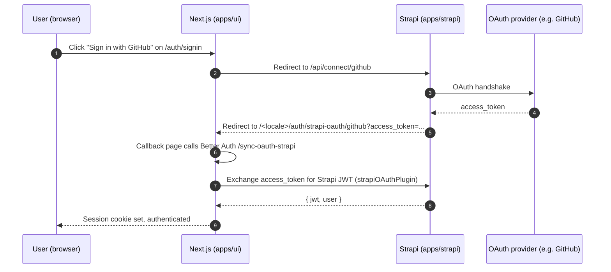

# OAuth Providers (GitHub, Google, etc.)

End-user social login via Strapi's Users & Permissions plugin. Distinct from admin SSO ([Microsoft SSO](./microsoft-sso.md)) — these providers authenticate the public users of your app, not the Strapi admins.

For the underlying auth architecture see [Authentication](./authentication.md).

## Flow



The callback page is [`apps/ui/src/app/[locale]/auth/strapi-oauth/[provider]/page.tsx`](https://github.com/notum-cz/strapi-next-monorepo-starter/blob/main/apps/ui/src/app/%5Blocale%5D/auth/strapi-oauth/%5Bprovider%5D/page.tsx). The Better Auth plugin handling the exchange is `strapiOAuthPlugin` in [`apps/ui/src/lib/auth.ts:334`](https://github.com/notum-cz/strapi-next-monorepo-starter/blob/main/apps/ui/src/lib/auth.ts#L334).

## Setup

Each provider requires three coordinated configurations: the provider's developer console, the Strapi admin, and (if local) a tunneling service.

### 1. Strapi admin

- Settings → Users & Permissions → Providers
- Enable the provider (e.g. `github`)
- Set **Client ID** and **Client Secret** (from the provider's developer console — see step 2)
- **Redirect URL** = your frontend callback: `https://your-domain.com/auth/strapi-oauth/github`

### 2. Provider developer console (example: GitHub)

GitHub → Settings → Developer settings → OAuth Apps → New OAuth App:

- **Homepage URL** = your Strapi URL, e.g. `https://your-domain.com`
- **Authorization callback URL** = `https://your-domain.com/api/connect/github/callback`

Copy generated Client ID + Secret into the Strapi admin (step 1).

No frontend code changes needed — `SignInForm` already routes to `/api/connect/<provider>` on button click. To add a new provider button, extend [`SocialButtons.tsx`](https://github.com/notum-cz/strapi-next-monorepo-starter/blob/main/apps/ui/src/app/%5Blocale%5D/auth/signin/_components/SocialButtons.tsx).

## Local Development with ngrok

Most OAuth providers reject `localhost` callbacks. Use ngrok (or similar) to tunnel.

1. Install ngrok: `brew install ngrok`
2. Start Strapi: `pnpm dev:strapi`
3. Tunnel Strapi:

   ```bash
   ngrok http 1337
   ```

4. Copy the generated URL (e.g. `https://abc123.ngrok.io`)
5. Update [`apps/strapi/config/server.ts`](https://github.com/notum-cz/strapi-next-monorepo-starter/blob/main/apps/strapi/config/server.ts):

   ```ts
   url: "https://abc123.ngrok.io"
   ```

6. Update [`apps/strapi/src/admin/vite.config.ts`](https://github.com/notum-cz/strapi-next-monorepo-starter/blob/main/apps/strapi/src/admin/vite.config.ts):

   ```ts
   server: {
     allowedHosts: ["abc123.ngrok.io"]
   }
   ```

7. Set env var in `apps/strapi/.env`:

   ```bash
   APP_URL=https://abc123.ngrok.io
   ```

8. GitHub OAuth App:
   - Homepage URL: `https://abc123.ngrok.io`
   - Authorization callback: `https://abc123.ngrok.io/api/connect/github/callback`

9. Strapi admin → Providers → GitHub → Redirect URL: `http://localhost:3000/auth/strapi-oauth/github`
10. Restart both Strapi and Next.js

## Supported Providers

Any provider implemented by Strapi's Users & Permissions plugin: GitHub, Google, Facebook, Discord, etc. See the [Strapi providers docs](https://docs.strapi.io/cms/configurations/users-and-permissions-providers).

## Related Documentation

- [Authentication](./authentication.md) — Better Auth session + Strapi JWT
- [Microsoft SSO](./microsoft-sso.md) — admin-panel SSO via Microsoft Entra ID
- [Architecture](../architecture.md#authentication) — high-level auth flow diagram
