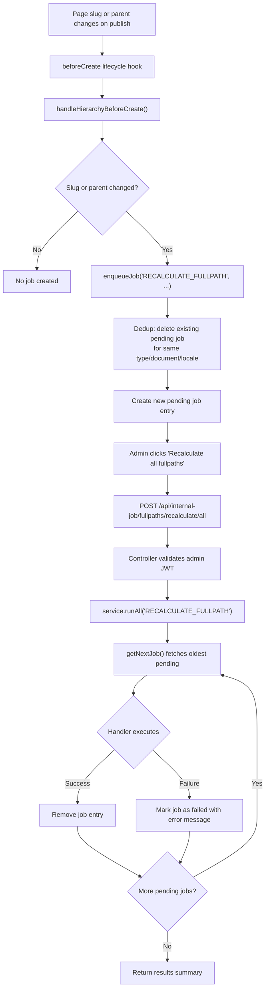

# Internal jobs

The internal jobs system is an async job queue built on a Strapi collection type. It manages two operations triggered by page hierarchy changes: recalculating `fullPath` values and creating redirects from old paths to new paths.

Jobs are not processed immediately. They are enqueued as pending entries and executed on demand via admin panel buttons or custom API endpoints.

## Content type schema

Collection type `api::internal-job.internal-job` with `draftAndPublish: false`.

| Field               | Type        | Values / Constraints                                  | Purpose                                       |
| ------------------- | ----------- | ----------------------------------------------------- | --------------------------------------------- |
| `jobType`           | enumeration | `RECALCULATE_FULLPATH`, `CREATE_REDIRECT`             | Determines which handler processes the job    |
| `state`             | enumeration | `pending`, `completed`, `failed` (default: `pending`) | State machine for job lifecycle               |
| `relatedDocumentId` | string      | Strapi document ID                                    | The page this job operates on                 |
| `targetLocale`      | string      | e.g. `"en"`, `"cs"`                                   | Locale scope for the operation                |
| `documentType`      | string      | Regex: `^(api::page.page)$`                           | Collection UID (currently pages only)         |
| `slug`              | string      | Optional                                              | Display hint in admin panel                   |
| `payload`           | json        | Handler-specific data                                 | Carries `oldPath`/`newPath` for redirect jobs |
| `error`             | string      | Null until failure                                    | Error message from failed handler execution   |

**Source:** `apps/strapi/src/api/internal-job/content-types/internal-job/schema.json`

## Job lifecycle



### Step-by-step

1. A page is published with a changed `slug` or `parent` relation.
2. The `beforeCreate` lifecycle hook calls `handleHierarchyBeforeCreate()`.
3. The handler calls `enqueueJob("RECALCULATE_FULLPATH", ...)` on the internal job service.
4. `enqueueJob` deduplicates: if a pending job already exists for the same `jobType`, `relatedDocumentId`, and `targetLocale`, it deletes the old one before creating the new entry.
5. An admin navigates to the Internal Jobs list view and clicks **Recalculate all fullpaths**.
6. The button sends a POST to the custom endpoint. The controller validates the admin JWT token.
7. `service.runAll()` loops: fetch next pending job, run handler, remove on success or mark failed with error, repeat until no pending jobs remain.

## Job handlers

### `processRecalculateFullPathJob`

Recalculates `fullPath` for a page and cascades to all children.

**Steps:**

1. Fetch the page document with `parent` and `children` populated.
2. Compute `newFullPath` from `parent.fullPath` + `slug` using `normalizePageFullPath()`.
3. If `fullPath` changed:
   - Update the page with the new `fullPath` (published, `updatedBy: null` to prevent re-triggering the lifecycle hook).
   - Enqueue `RECALCULATE_FULLPATH` jobs for every child page.
4. Check for an existing pending `CREATE_REDIRECT` job for the same document. If one exists, use its original `oldPath` instead of the current `fullPath` (handles multiple recalculations before redirect creation).
5. If the path actually changed (old != new), enqueue a `CREATE_REDIRECT` job with `{ oldPath, newPath }` payload (locale-prefixed).
6. If the path reverted to the original value, delete the existing redirect job.

```typescript title="apps/strapi/src/utils/hierarchy/index.ts (excerpt)"
export const processRecalculateFullPathJob = async (
  job: Data.ContentType<"api::internal-job.internal-job">
) => {
  // ...
  const newFullPath = normalizePageFullPath([
    document.parent?.fullPath,
    document.slug,
  ])

  if (newFullPath !== oldFullPath) {
    await strapi.documents(documentType as HierarchicalDocumentType).update({
      documentId: document.documentId,
      data: { fullPath: newFullPath, updatedBy: null },
      locale: targetLocale,
      status: "published",
    })

    // Cascade to children
    for (const child of children) {
      await strapi
        .service("api::internal-job.internal-job")
        .enqueueJob("RECALCULATE_FULLPATH", {
          /* child data */
        })
    }
  }
  // ... redirect job creation/cleanup
}
```

### `processCreateRedirectJob`

Creates a published redirect entry from the old path to the new path.

```typescript title="apps/strapi/src/utils/hierarchy/index.ts (excerpt)"
export const processCreateRedirectJob = async (
  job: Data.ContentType<"api::internal-job.internal-job">
) => {
  const payload = job.payload as CreateRedirectPayload | null
  if (!payload) return

  await strapi.documents("api::redirect.redirect").create({
    data: {
      source: payload.oldPath,
      destination: payload.newPath,
      permanent: true,
    },
    status: "published",
  })
}
```

Paths in the payload include the locale prefix (e.g. `/en/about` to `/en/about-us`).

### Handler map

The service maps job types to handler functions:

```typescript title="apps/strapi/src/api/internal-job/services/internal-job.ts (excerpt)"
getJobHandlers(): Record<
  Data.ContentType<"api::internal-job.internal-job">["jobType"],
  Function
> {
  return {
    RECALCULATE_FULLPATH: processRecalculateFullPathJob,
    CREATE_REDIRECT: processCreateRedirectJob,
  }
}
```

`runAll()` calls `handlers[jobType](job)` in a loop until no pending jobs remain for the given type.

## Custom API endpoints

| Method | Path                                          | Controller action           | Purpose                                   |
| ------ | --------------------------------------------- | --------------------------- | ----------------------------------------- |
| POST   | `/api/internal-job/fullpaths/recalculate/all` | `runRecalculateFullpathAll` | Run all pending RECALCULATE_FULLPATH jobs |
| POST   | `/api/internal-job/redirects/create/all`      | `runCreateRedirectsAll`     | Run all pending CREATE_REDIRECT jobs      |

Both endpoints return `{ successfulJobs: string[], failedJobs: string[] }` with arrays of document IDs.

:::warning[Authentication pattern]

These routes set `auth: false` in the Strapi route config, which disables Strapi's built-in authentication middleware. However, the controller **manually validates an admin JWT token** against `admin.auth.secret`:

```typescript title="apps/strapi/src/api/internal-job/controllers/internal-job.ts (excerpt)"
const validateAdminToken = (strapi, headers) => {
  const authHeader = headers["authorization"]
  const token = authHeader?.split(" ")[1]
  if (!token) {
    return { valid: false, error: "No token provided" }
  }

  const decoded = jwt.verify(token, strapi.config.get("admin.auth.secret")) as {
    userId?: string
  }
  if (!decoded?.userId) {
    return { valid: false, error: "Invalid token" }
  }

  return { valid: true, userId: decoded.userId }
}
```

This is intentional. The admin panel's `getFetchClient()` automatically attaches the admin JWT token to requests. Strapi's content API auth (`users-permissions` plugin) uses a different token type and would reject admin tokens. By disabling Strapi auth and validating the admin token manually, the endpoints are callable from the admin extension while remaining protected from unauthenticated access.

:::

## Admin extension UI

The admin panel includes action buttons on the Internal Jobs list view for triggering job execution.

### Component injection

Registered in `apps/strapi/src/admin/app.tsx`:

```typescript title="apps/strapi/src/admin/app.tsx (excerpt)"
app.getPlugin("content-manager").injectComponent("listView", "actions", {
  name: "InternalJobs",
  Component: InternalJobs,
})
```

### Gate component

`InternalJobs` (index) checks whether the current content manager model is `api::internal-job.internal-job`. Returns `null` for all other models so the buttons only appear on the Internal Jobs list view.

```typescript title="apps/strapi/src/admin/extensions/InternalJobs/index.tsx"
function InternalJobs() {
  const ctx = unstable_useContentManagerContext()
  const { model: uid } = ctx || {}

  if (uid !== "api::internal-job.internal-job") {
    return null
  }

  return <InternalJobsActions />
}
```

### Action buttons

`InternalJobActions` renders two buttons: **Recalculate all fullpaths** and **Create all redirects**.

| Behavior                | Detail                                                      |
| ----------------------- | ----------------------------------------------------------- |
| **Disabled state**      | Both buttons disabled when no rows exist in the collection  |
| **Loading state**       | Running button shows spinner; other button disabled         |
| **Confirmation dialog** | `confirm()` prompt before execution warns about performance |
| **Success handling**    | Toast notification, page reload after 1.5 s                 |
| **Error handling**      | Toast notification with error message, logged to console    |

The buttons use `getFetchClient().post()` which automatically includes the admin JWT token in the `Authorization` header.

## Known limitations

:::info[Limitations]

- **No retry mechanism.** Failed jobs stay in `failed` state. To re-process, manually delete the failed job and re-trigger the original change (slug or parent) to create a new pending job.
- **Untyped handler map.** `getJobHandlers()` returns `Record<..., Function>` -- the `Function` type provides no parameter or return type safety.
- **Manual JWT validation.** Auth bypasses Strapi's middleware layer (see [Authentication pattern](#custom-api-endpoints) above). Changes to `admin.auth.secret` or admin JWT format could silently break these endpoints.
- **Sequential processing.** `runAll()` processes jobs one at a time in creation order. Large batches of hierarchy changes may take significant time.

:::

## Related documentation

- [Pages Hierarchy](./pages-hierarchy.md) -- the page hierarchy system that triggers these jobs
- [Strapi Schemas](./schemas.md) -- schema patterns and content type conventions
