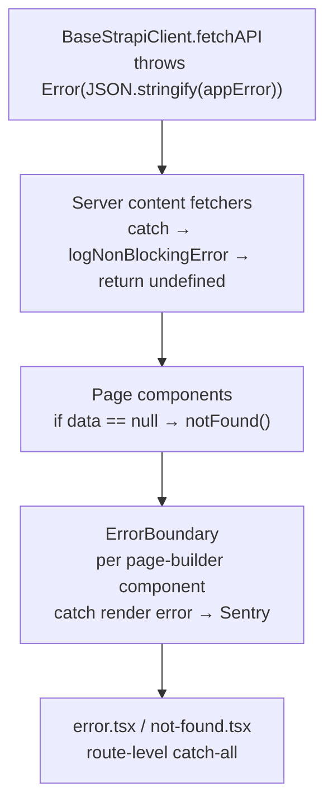

# Error Handling

The application handles errors through five layers, from the deepest (type definition) to the outermost (route-level handler). Each layer catches what the previous one cannot, creating a defense-in-depth chain.

## Error Chain Overview



## AppError Type

The structured error format used across the API layer. When `BaseStrapiClient` encounters an error, it serializes this type into a thrown `Error` message.

```typescript title="apps/ui/src/types/general.ts"
export interface AppError {
  message: string | number
  status: number
  name?: string
  details?: Record<string, unknown>
}
```

| Field     | Type               | Purpose                                                           |
| --------- | ------------------ | ----------------------------------------------------------------- |
| `message` | `string \| number` | Human-readable error description                                  |
| `status`  | `number`           | HTTP status code from Strapi                                      |
| `name`    | `string?`          | Error name (e.g., `"NotFoundError"`, `"Invalid response format"`) |
| `details` | `Record?`          | Extra context (includes request URL)                              |

## BaseStrapiClient Throw Layer

`BaseStrapiClient.fetchAPI` is the lowest error origin. It throws in two cases: non-JSON responses and non-2xx status codes. Both serialize `AppError` as the error message.

```typescript title="apps/ui/src/lib/strapi-api/base.ts"
// Case 1: Non-JSON response
if (text) {
  const appError: AppError = {
    name: "Invalid response format",
    message: text,
    status: response.status,
    details: { url },
  }
  console.error("[BaseStrapiClient] Strapi API request error:", appError)
  throw new Error(JSON.stringify(appError))
}

// Case 2: Non-2xx status
if (!response.ok) {
  const { error } = json
  const appError: AppError = {
    name: error?.name,
    message: error?.message,
    details: { url },
    status: response.status ?? error?.status,
  }
  throw new Error(JSON.stringify(appError))
}
```

## Non-Throwing Server Fetchers

:::tip[Non-throwing convention]
Server content fetchers (`fetchPage`, `fetchNavbar`, `fetchFooter`, etc.) **never throw**. They wrap `BaseStrapiClient` calls in try/catch, log the error via `logNonBlockingError`, and return `undefined`. Callers check for null and call `notFound()` when data is missing.
:::

```typescript title="apps/ui/src/lib/strapi-api/content/server.ts"
export async function fetchPage(
  fullPath: string,
  locale: Locale,
  requestInit?: RequestInit,
  options?: CustomFetchOptions
) {
  const dm = await draftMode()

  try {
    return await PublicStrapiClient.fetchOneByFullPath(
      "api::page.page",
      fullPath,
      {
        locale,
        status: dm.isEnabled ? "draft" : "published",
        populate: { seo: seoPopulate },
        populateDynamicZone: { content: true },
      },
      requestInit,
      options
    )
  } catch (e: unknown) {
    logNonBlockingError({
      message: `Error fetching page '${fullPath}' for locale '${locale}'`,
      error: {
        error: e instanceof Error ? e.message : String(e),
        stack: e instanceof Error ? e.stack : undefined,
      },
    })
  }
}
```

All server fetchers follow the same pattern: `fetchNavbar`, `fetchFooter`, `fetchSeo`, and `fetchAllPages`.

### logNonBlockingError

A gate function that only logs to `console.error` when the `SHOW_NON_BLOCKING_ERRORS` environment variable is truthy. This prevents memory buildup during static builds where errors are logged but execution continues.

```typescript title="apps/ui/src/lib/logging.ts"
export const logNonBlockingError = (...args: unknown[]) => {
  const showErrors = getEnvVar("SHOW_NON_BLOCKING_ERRORS")
  if (showErrors) {
    console.error(...args)
  }
}
```

:::warning
Without `SHOW_NON_BLOCKING_ERRORS=true`, fetch errors are silently swallowed. Enable this variable during development and debugging to see error details.
:::

## ErrorBoundary Component

A React error boundary wrapping each page-builder component in `StrapiPageView`. Uses `react-error-boundary` internally.

```typescript title="apps/ui/src/components/elementary/ErrorBoundary.tsx"
const handleError = (
  error: Error & { digest?: string },
  info: { componentStack?: string | null; digest?: string | null }
) => {
  const digest = error.digest ?? info.digest
  if (digest === "NEXT_NOT_FOUND" || digest?.includes("404")) {
    throw error // re-throw so Next.js handles notFound()
  }

  if (onError) {
    onError(error, info)
  }

  Sentry.captureException(error)
}
```

**Behavior:**

| Scenario                         | Action                                                            |
| -------------------------------- | ----------------------------------------------------------------- |
| `NEXT_NOT_FOUND` digest          | Re-throws to let Next.js `not-found.tsx` handle it                |
| Other render error (production)  | Reports to Sentry, shows dismissable alert                        |
| Other render error (development) | Reports to Sentry, shows alert with error message and stack trace |
| User clicks "Try again"          | Calls `resetErrorBoundary()` to attempt re-render                 |
| User clicks dismiss (X)          | Hides the alert entirely                                          |

The component accepts several props for customization:

- `hideReset` -- hide the "Try again" button
- `hideFallback` -- render nothing on error (returns `null`)
- `customErrorTitle` -- override the default error title
- `showErrorMessage` -- show error message even in production
- `onError` -- custom error handler callback

## Route-Level Error Handlers

### error.tsx

The Next.js route-level error boundary. Catches any unhandled error that escapes the component tree.

```typescript title="apps/ui/src/app/[locale]/error.tsx"
export default function ErrorPage({ error, reset }: Props) {
  const t = useTranslations("errors.global")

  useEffect(() => {
    Sentry.captureException(error)
  }, [error])

  return (
    <div>
      <h1>{t("somethingWentWrong")}</h1>
      <p>
        {t("invalidContent")}
        {isDev ? `: ${error.message}` : null}
      </p>
      {isDev && <pre>{error.stack?.split("\n").slice(0, 7).join("\n")}</pre>}
      <Button onClick={reset}>{t("tryAgain")}</Button>
    </div>
  )
}
```

- Reports every error to Sentry via `useEffect`
- Shows error message and stack trace only in development
- Provides a "Try again" button that calls `reset()` to attempt route re-render
- Uses i18n translations from the `errors.global` namespace

### not-found.tsx

Handles `notFound()` calls from server components (typically when `fetchPage` returns `undefined`).

```typescript title="apps/ui/src/app/[locale]/not-found.tsx"
export default async function NotFound() {
  const t = await getTranslations("errors.notFound")

  return (
    <div>
      <h2>{t("title")}</h2>
      <p>{t("description")}</p>
      <p>{t("solution")}</p>
      <Link href="/">{t("redirect")}</Link>
    </div>
  )
}
```

- Server component using `getTranslations` for i18n
- Shows translated 404 message with a link back to the homepage
- Uses the locale-aware `Link` from `@/lib/navigation`

## Auth Error Conversion

The `throwBetterAuthError` function in `apps/ui/src/lib/auth.ts` converts Strapi API errors into Better Auth `APIError` instances with typed HTTP status codes. Used in all auth plugin endpoints.

```typescript title="apps/ui/src/lib/auth.ts"
const throwBetterAuthError = (
  strapiError: unknown,
  fallbackMessage: string,
  fallbackStatus = 500
) => {
  if (strapiError instanceof APIError) {
    throw strapiError
  }

  const e = safeJSONParse<{
    status?: number
    message?: string
    name?: string
  }>(
    typeof strapiError === "string"
      ? strapiError
      : ((strapiError as Error)?.message ?? "")
  )

  const message = typeof e?.message === "string" ? e.message : fallbackMessage

  const statuses = {
    400: "BAD_REQUEST",
    401: "UNAUTHORIZED",
    403: "FORBIDDEN",
    404: "NOT_FOUND",
    409: "CONFLICT",
    422: "UNPROCESSABLE_ENTITY",
    429: "TOO_MANY_REQUESTS",
  } as const

  // Maps numeric status to Better Auth status text
}
```

This function is called in every `catch` block of the auth plugin endpoints (sign-in, register, forgot-password, reset-password, update-password, OAuth sync) to ensure consistent error responses.

## Related Documentation

- [Strapi API Client](./api-client.md) -- `BaseStrapiClient` fetch methods and error throwing
- [Rendering & Composition](../architecture/rendering-composition.md) -- component boundaries where `ErrorBoundary` is applied
- [Authentication](./authentication.md) -- auth plugin endpoints that use `throwBetterAuthError`
