# Cache Revalidation

How Strapi content updates become visible on the Next.js frontend without a rebuild — and how operators force a CDN purge when something must change before its cache window expires.

## How It Works

Each public route has an ISR `revalidate` window. Combined with `stale-while-revalidate`, visitors never block on a TTL boundary — they get the cached version immediately and the page regenerates in the background.

On publish/update/delete, a Strapi **Document Service middleware** calls the `api::revalidate.revalidate` service, which POSTs to the Next.js route `/api/strapi-revalidate`. That route marks the matching cache entries stale via `revalidatePath` (page/redirect paths) and `revalidateTag` (shared content such as navbar/footer). The next request triggers a fresh render without waiting for the TTL to expire.

:::tip Why readers never see a slow page
On-demand revalidation makes content fresh quickly, but it is not what protects latency. `stale-while-revalidate` does: a stale entry is served instantly while the new one renders in the background. Revalidation only decides _when_ the entry is marked stale.
:::

A CDN purge is a **separate, optional** mechanism for incident-time eviction — see [CDN Purge](./integrations/cdn-purge.md).

## Flow

```mermaid
flowchart TD
  subgraph automatic["Automatic — on publish"]
    change["Strapi publish / update / delete"]
    mw["Document middleware<br/>(documentMiddlewares/revalidate.ts)"]
    svc["api::revalidate.revalidate service"]
    uiRevalidate["Next.js POST /api/strapi-revalidate"]
    nextCache["revalidatePath() / revalidateTag()"]
    change --> mw --> svc --> uiRevalidate --> nextCache
  end

  subgraph manual["Operator — incident-time (optional)"]
    widget["CDN cache widget<br/>(Strapi homepage)"]
    strapiPurge["Strapi POST /api/revalidate/cdn-purge"]
    uiPurge["Next.js POST /api/cdn-purge"]
    provider["CDN provider<br/>(Azure Front Door example)"]
    widget --> strapiPurge --> uiPurge --> provider
  end
```



## Revalidate Intervals

**Route-level** (`export const revalidate` in the route segment):

| Route                   | Interval | Notes                              |
| ----------------------- | -------- | ---------------------------------- |
| `/[locale]/[[...rest]]` | **300s** | All Strapi-driven CMS pages (ISR). |

**Per-`fetch`** (Next.js Data Cache, set in `apps/ui/src/lib/strapi-api/content/server.ts`):

| Fetch                        | Interval          | Reason                                                                                                         |
| ---------------------------- | ----------------- | -------------------------------------------------------------------------------------------------------------- |
| `fetchPage`, `fetchSeo`      | **120s**          | Page-specific data; refreshed on publish via `revalidatePath`.                                                 |
| `fetchNavbar`, `fetchFooter` | **600s (10 min)** | Shared content tagged `strapi:api::<uid>`. `revalidateTag` invalidates these on edit; the TTL is the backstop. |

:::note Route window vs. fetch window
The route ISR window (300s) and a page's data-fetch window (120s) are independent backstops. On publish, `revalidatePath(fullPath)` invalidates the route immediately, so neither TTL gates how fast an edit appears — the TTLs only bound staleness when no publish event fires.
:::

Next.js derives the CDN cache header from the route `revalidate`, e.g.:

```
cache-control: s-maxage=300, stale-while-revalidate=<large>
```

The long SWR window keeps the cache resilient if the origin is briefly unavailable; readers never observe it directly.

## What Gets Revalidated

The UI route accepts two inputs:

- **`next.fullPaths`** — page-level paths (e.g. `/en/about`), invalidated with `revalidatePath`.
- **`next.tags`** — Data Cache tags for shared content (e.g. `strapi:api::navbar.navbar`), invalidated with `revalidateTag`.

:::note Tag revalidation handles cross-page invalidation
A fetch tagged `strapi:api::footer.footer` is consumed by every page that renders the footer. `revalidateTag` invalidates both the Data Cache entry **and** the Full Route Cache of every route that depended on it — no hand-curated page list is required.
:::

## Where Revalidation Is Triggered

- **Document Service middleware** — on publish/update of configured collections.
- **Hierarchy jobs** — after recalculating page paths in bulk (see below).
- **CDN cache widget** — manual, operator-driven (optional; see [CDN Purge](./integrations/cdn-purge.md)).
- **Hidden admin action** — the **Revalidate cache** button in the edit view, shown only with `?showRevalidateCache=true` (a debug escape hatch).

## Document Middleware

`apps/strapi/src/documentMiddlewares/revalidate.ts` auto-revalidates configured collections:

- **Path revalidation** (`next.fullPaths`) for page-like collections — `api::page.page` (by `fullPath`) and `api::redirect.redirect` (by `source`).
- **Tag revalidation** (`next.tags`) for shared single types — `api::navbar.navbar`, `api::footer.footer`.

Each shared fetch is tagged `strapi:<uid>`; the middleware sends those tags (plus any fullPaths) to `/api/strapi-revalidate`. Add your own content types to `REVALIDATE_COLLECTIONS` in the middleware and tag the matching fetch in `content/server.ts`.

Policy derives from each content type's `draftAndPublish` setting:

- `true` → revalidate on **publish / unpublish / delete** only.
- `false` → revalidate on **every save**.

## Hierarchy Jobs

When a slug or parent changes, Strapi recalculates `fullPath` for affected pages through the `internal-job` queue. Those programmatic writes use `updatedBy: null`, and the document middleware **skips** them to avoid duplicate calls. Instead, the job runner (`runAll`) aggregates the touched paths and revalidates them once per batch.

## Locale Handling

Strapi stores canonical paths without the default-locale prefix. Both `/api/strapi-revalidate` and `/api/cdn-purge` expand default-locale variants (`apps/ui/src/lib/cache-paths.ts`) before acting:

| Canonical  | Expanded                  |
| ---------- | ------------------------- |
| `/careers` | `/en/careers`, `/careers` |
| `/`        | `/en`, `/`                |
| `/jobs/*`  | `/en/jobs/*`, `/jobs/*`   |
| `/*`       | `/*`                      |

## Operator Purge — CDN Cache Widget

The Strapi homepage shows a **CDN cache** widget. Editors choose **specific paths** (one per line, wildcards allowed) or **entire site** (`/*`, with a confirmation prompt) and submit. The widget POSTs to Strapi `/api/revalidate/cdn-purge` (admin-JWT protected), which calls `purgeCDNCache`, which POSTs to Next.js `/api/cdn-purge`, which expands locale variants and delegates to the configured CDN provider. Upstream error messages propagate back into the toast.

:::info Optional and inert by default
CDN purge is a pluggable provider. When no provider is configured, `resolveCdnProvider()` returns `null` and the widget reports that no provider is configured — nothing breaks. Azure Front Door ships as the example provider. See [CDN Purge](./integrations/cdn-purge.md).
:::

Use it for hot fixes, takedowns, or broken redirects whose stale behavior cannot wait for the TTL. Routine publishes do not need it — the ISR window plus `revalidateTag`/`revalidatePath` already cover them.

## Redirects

Redirects revalidate by their `source` path through the same flow as other content. They do not trigger an automatic CDN purge; an operator can force one through the widget if stale routing would break navigation in a way that cannot wait for the TTL.

## Security

:::caution Shared secret + admin JWT
`STRAPI_REVALIDATE_SECRET` is shared between Strapi and Next.js — Strapi includes it in every revalidate/purge request, and Next.js validates it before doing any work. The Strapi purge endpoint (`/api/revalidate/cdn-purge`) **additionally** requires a valid admin JWT.
:::

## UI Endpoint Payload

Strapi never crafts this shape by hand; the `revalidate` service builds it from the simpler `/api/revalidate` input (`uid`, `fullPaths?`, `locale?`, `tags?`).

```json
{
  "uid": "api::page.page",
  "secret": "STRAPI_REVALIDATE_SECRET",
  "next": {
    "fullPaths": ["/about"],
    "tags": ["strapi:api::page.page"]
  }
}
```

At least one of `next.fullPaths` or `next.tags` must be set.

## Required Configuration

| Variable                                     | Where         | Purpose                                             |
| -------------------------------------------- | ------------- | --------------------------------------------------- |
| `STRAPI_REVALIDATE_SECRET`                   | Strapi + UI   | Shared secret authenticating revalidate/purge calls |
| `CLIENT_URL`                                 | Strapi        | Next.js frontend base URL                           |
| `STRAPI_URL`, `STRAPI_REST_READONLY_API_KEY` | UI            | UI-side Strapi reads (used by the public client)    |
| `AZURE_*`, `IDENTITY_*`                      | UI (optional) | CDN purge via the Azure Front Door example provider |

See [Strapi environment variables](../strapi/environment-variables.md) and [UI environment variables](../ui/environment-variables.md).

## Testing

:::warning `next dev` does not exercise the cache
Dev mode skips the Data Cache (every request re-renders), so `revalidatePath`/`revalidateTag` have nothing to invalidate. The full cycle is only observable on a production build (`pnpm run build:ui && pnpm run start:ui`).
:::

**What dev mode does verify:**

- **Endpoint logic** — call `/api/strapi-revalidate` directly with the right secret and confirm the log line.
- **Middleware fires** — publish a page, check Strapi logs for the revalidation call.
- **Widget purge** — submit a path through the widget, check Next.js logs for the purge request.

**Production-build cycle:**

1. Visit a page — it gets cached.
2. Change the content in Strapi and publish.
3. Refresh — the update appears within the route's `revalidate` window (immediately if the publish event reached `/api/strapi-revalidate`).

## Developer References

- `apps/ui/src/app/api/strapi-revalidate/route.ts`
- `apps/ui/src/app/api/cdn-purge/route.ts`
- `apps/ui/src/lib/cache-paths.ts`
- `apps/ui/src/lib/cdn/index.ts` (provider registry) and `apps/ui/src/lib/cdn/providers/azure-front-door.ts`
- `apps/ui/src/lib/strapi-api/content/server.ts` (cache tags)
- `apps/strapi/src/api/revalidate/services/` (`revalidate.ts`, `next-cache.ts`, `cdn-cache.ts`, `helpers.ts`)
- `apps/strapi/src/api/revalidate/controllers/revalidate.ts`, `routes/revalidate.ts`
- `apps/strapi/src/documentMiddlewares/revalidate.ts`
- `apps/strapi/src/utils/hierarchy/index.ts`
- `apps/strapi/src/admin/widgets/CdnCacheWidget/index.tsx`
- `apps/strapi/src/admin/extensions/DataRevalidate/`
