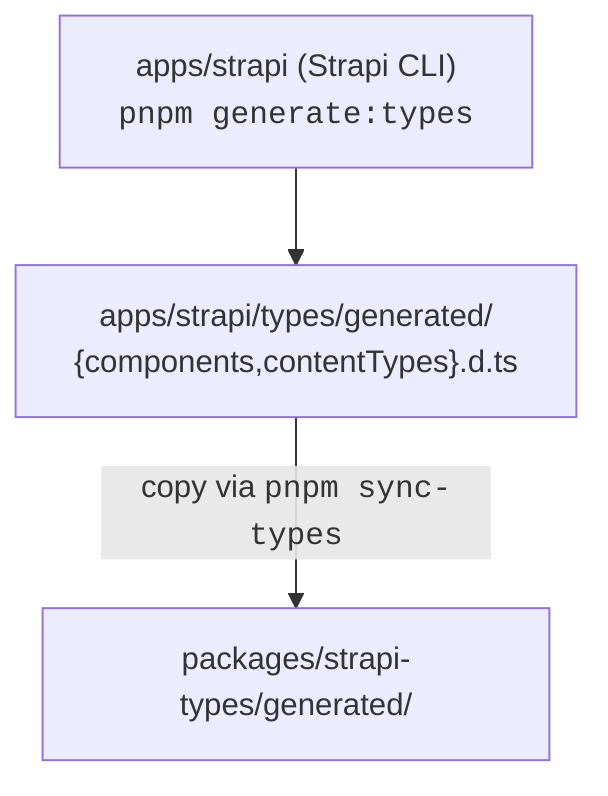

# Packages

Shared code lives in [`packages/*`](https://github.com/notum-cz/strapi-next-monorepo-starter/tree/main/packages). Six active packages plus two empty placeholders. All packages run on `node ^24.0.0`. Workspaces are declared in [`pnpm-workspace.yaml`](https://github.com/notum-cz/strapi-next-monorepo-starter/blob/main/pnpm-workspace.yaml) (`packages/*`, `apps/*`, `qa/**`).

## Overview

| Package                                                         | Role                                                    | Build                         | Consumers                |
| --------------------------------------------------------------- | ------------------------------------------------------- | ----------------------------- | ------------------------ |
| [`@repo/design-system`](#repodesign-system)                     | Tailwind + PostCSS pipeline, editor color/font JSON     | Tailwind CLI + 2 node scripts | `apps/ui`, `apps/strapi` |
| [`@repo/shared-data`](#reposhared-data)                         | Path utilities used on both Strapi and Next             | `tsc`                         | `apps/ui`, `apps/strapi` |
| [`@repo/strapi-types`](#repostrapi-types)                       | Re-exports Strapi SDK types + symlinked generated types | None (types only)             | `apps/ui`                |
| [`@repo/eslint-config`](#repoeslint-config)                     | Composed flat ESLint config                             | None                          | root `eslint.config.mjs` |
| [`@repo/typescript-config`](#repotypescript-config)             | Shared `tsconfig` presets                               | None                          | both apps                |
| [`@repo/semantic-release-config`](#reposemantic-release-config) | Shared semantic-release config                          | None                          | root release pipeline    |

Empty placeholders: `packages/prettier-config/`, `packages/strapi-plugin-tiptap-editor/`. Reserved directories — no files yet.

---

## `@repo/design-system`

Tailwind v4 styles plus tooling that generates JSON configs for the in-Strapi editors (CKEditor + Tiptap) from the same CSS variables.

**Exports** (from [package.json](https://github.com/notum-cz/strapi-next-monorepo-starter/blob/main/packages/design-system/package.json)):

| Specifier                    | File                                 | Purpose                                                                     |
| ---------------------------- | ------------------------------------ | --------------------------------------------------------------------------- |
| `./theme.css`                | `src/theme.css`                      | Source theme variables. Import directly to consume tokens.                  |
| `./custom-styles.css`        | `src/custom-styles.css`              | Additional handwritten CSS.                                                 |
| `./styles.css`               | `dist/styles.css`                    | Compiled Tailwind output. **Built artefact — must run `pnpm build` first.** |
| `./tiptap-theme.css`         | `dist/tiptap-theme.css`              | Tiptap theme override.                                                      |
| `./tiptap-color-config.json` | `dist/tiptap-color-config.json`      | Color palette fed into Tiptap editor config.                                |
| `./ck-color-config.json`     | `dist/ckeditor-color-config.json`    | Same for CKEditor.                                                          |
| `./ck-fontSize-config.json`  | `dist/ckeditor-fontSize-config.json` | Font-size options for CKEditor.                                             |
| `./styles-strapi.json`       | `dist/styles-strapi.json`            | Full compiled CSS string injected into Strapi's CKEditor instance.          |

**Build**:

```bash
tailwindcss -i ./src/styles.css -o ./dist/styles.css
node ./src/build-ck-config.js
node ./src/build-tiptap-config.js
```

The two node scripts parse the compiled CSS variables and emit the editor JSON configs — so when designers change a token in `theme.css`, both editors update on the next build.

`turbo.json` makes `dev` depend on this package's `build` so `apps/ui` and `apps/strapi` see the compiled CSS during local development.

---

## `@repo/shared-data`

Minimal utilities that must exist in both runtimes (Strapi and Next).

**Exports** from [`index.ts`](https://github.com/notum-cz/strapi-next-monorepo-starter/blob/main/packages/shared-data/index.ts):

| Symbol                                  | Type     | Purpose                                                                                                                                               |
| --------------------------------------- | -------- | ----------------------------------------------------------------------------------------------------------------------------------------------------- |
| `ROOT_PAGE_PATH`                        | `"/"`    | Used as the canonical root in both Strapi page `fullPath` values and the Next.js catch-all.                                                           |
| `normalizePageFullPath(paths, locale?)` | function | Joins slug segments into a normalized path. Handles duplicate slashes, empty segments, optional locale prefix. Idempotent for already-prefixed paths. |

**Build**: `tsc` emits `dist/index.js` + `.d.ts`. No runtime deps.

Used in [`apps/ui/src/lib/navigation.ts`](https://github.com/notum-cz/strapi-next-monorepo-starter/blob/main/apps/ui/src/lib/navigation.ts) (`createPublicFullPath`) and on the Strapi side where parent/child slugs are concatenated into the cached `fullPath`.

---

## `@repo/strapi-types`

Bridges Strapi's TypeScript engine into the rest of the monorepo. No runtime code — types only.

**Exports** (from [package.json](https://github.com/notum-cz/strapi-next-monorepo-starter/blob/main/packages/strapi-types/package.json)):

| Specifier                  | Notes                                                                                                                                                                                                                                                                          |
| -------------------------- | ------------------------------------------------------------------------------------------------------------------------------------------------------------------------------------------------------------------------------------------------------------------------------ |
| `.`                        | Main entry [`src/index.ts`](https://github.com/notum-cz/strapi-next-monorepo-starter/blob/main/packages/strapi-types/src/index.ts). Re-exports `Data`, `Modules`, `UID` from `@strapi/strapi` and adds `ID`, `FindMany<T>`, `FindFirst<T>`, `FindOne<T>`, `Result<T, Params>`. |
| `./generated/components`   | Auto-generated component types.                                                                                                                                                                                                                                                |
| `./generated/contentTypes` | Auto-generated content-type types.                                                                                                                                                                                                                                             |

**Generation flow**:



`sync-types` is defined as `cp -r ../../apps/strapi/types/generated ./generated`. The `generated/` directory in this package is intended to be a refresh of the Strapi-side files — keep them in sync after any schema change. See [Strapi Types Usage](../content-system/strapi-types-usage.md).

`Result<TSchemaUID, TParams>` is re-declared (not re-exported from `@strapi/types`) to dodge a documented Strapi build issue — see comment in `src/index.ts:22-24`.

---

## `@repo/eslint-config`

Composed flat-config bundle. Default export is the array consumed by [root `eslint.config.mjs`](https://github.com/notum-cz/strapi-next-monorepo-starter/blob/main/eslint.config.mjs); the `./configs` subpath exposes each rule group separately so a package can opt in.

**Exports**:

| Specifier   | Purpose                                                                                                                                                                                                                                                                                                                                                                                              |
| ----------- | ---------------------------------------------------------------------------------------------------------------------------------------------------------------------------------------------------------------------------------------------------------------------------------------------------------------------------------------------------------------------------------------------------- |
| `.`         | Full pre-composed `FlatConfigArray`.                                                                                                                                                                                                                                                                                                                                                                 |
| `./configs` | Named exports: `base`, `javascript`, `imprt` (import-x), `vitest`, `prettier`, `prettierOptions`, `react`, `typescript`, `unusedImports`, `typescriptTypeChecked`, `sonarjs`, `unicorn`, `sortClassMembers`, `turbo`, `next`. See [`src/configs/index.d.ts`](https://github.com/notum-cz/strapi-next-monorepo-starter/blob/main/packages/eslint-config/src/configs/index.d.ts) for the type surface. |

`prettierOptions` is consumed by [root `prettier.config.mjs`](https://github.com/notum-cz/strapi-next-monorepo-starter/blob/main/prettier.config.mjs) so prettier and ESLint stay in sync.

Plugin set includes typescript-eslint, @stylistic, @next/eslint-plugin-next, react, react-hooks, sonarjs, unicorn, unused-imports, sort-class-members, turbo, vitest, prettier, jsx-a11y, import-x.

---

## `@repo/typescript-config`

Three `tsconfig` presets you `extends` from app/package configs.

| File                                                                                                                                     | Display                | Notes                                                                                                                                       |
| ---------------------------------------------------------------------------------------------------------------------------------------- | ---------------------- | ------------------------------------------------------------------------------------------------------------------------------------------- |
| [`base.json`](https://github.com/notum-cz/strapi-next-monorepo-starter/blob/main/packages/typescript-config/base.json)                   | `Default`              | `target: ES2022`, `strict`, `noUncheckedIndexedAccess`, NodeNext modules. Foundation for the other two.                                     |
| [`nextjs.json`](https://github.com/notum-cz/strapi-next-monorepo-starter/blob/main/packages/typescript-config/nextjs.json)               | `Next.js`              | Extends base. Adds Next.js plugin, switches to `module: ESNext`, `moduleResolution: Bundler`, `jsx: preserve`, `noEmit`. Used by `apps/ui`. |
| [`react-library.json`](https://github.com/notum-cz/strapi-next-monorepo-starter/blob/main/packages/typescript-config/react-library.json) | (React library preset) | Extends base. JSX mode for shipping React component libraries.                                                                              |

Apps use it via `"extends": "@repo/typescript-config/nextjs.json"` in their `tsconfig.json`.

---

## `@repo/semantic-release-config`

CommonJS module exporting a [semantic-release](https://semantic-release.gitbook.io/) config. Used by root release scripts.

```js
// packages/semantic-release-config/index.js
module.exports = {
  branches: ["main"],
  plugins: [
    [
      "@semantic-release/commit-analyzer",
      {
        releaseRules: [
          { type: "security", release: "patch" },
          { type: "chore", scope: "deps", release: "patch" },
        ],
      },
    ],
    "@semantic-release/release-notes-generator",
    "@semantic-release/github",
  ],
}
```

Custom rules add what stock conventional-commits doesn't: a `security:` commit triggers a patch bump (recent change — see [recent fix](https://github.com/notum-cz/strapi-next-monorepo-starter/commit/af3dbba)), and `chore(deps): ...` also patches. No npm publish — releases are GitHub-only via `@semantic-release/github`.

---

## Monorepo Plumbing

Files used by Turbo, pnpm, and git hooks to wire the workspace together.

### `pnpm-workspace.yaml`

- Globs: `packages/*`, `apps/*`, `qa/**`.
- `minimumReleaseAge: 5760` (4 days) — pnpm refuses to install dependency versions younger than this. Supply-chain hardening.
- `allowBuilds` whitelist for native build scripts (`sharp`, `esbuild`, `@parcel/watcher`, etc.).
- `overrides` pins `@types/react@19.2.14` / `@types/react-dom@19.2.3` repo-wide.

### `turbo.json`

Key task dependencies (see [`turbo.json`](https://github.com/notum-cz/strapi-next-monorepo-starter/blob/main/turbo.json)):

| Task                | Depends on                                             | Outputs / Notes                                        |
| ------------------- | ------------------------------------------------------ | ------------------------------------------------------ |
| `dev`               | `@repo/shared-data#build`, `@repo/design-system#build` | `persistent`, cache off                                |
| `build`             | `^build`                                               | `.next/**`, `dist/**`, `public/**` (`!.next/cache/**`) |
| `build:static`      | `^build`                                               | adds `out/**` for `next export`                        |
| `test`              | `^build`                                               | cached                                                 |
| `sync-types`        | —                                                      | cache off                                              |
| Playwright/LHCI/axe | —                                                      | cache off, ephemeral                                   |

`globalEnv` lists every env var that, when changed, invalidates Turbo's cache. Notable entries: `STRAPI_URL`, `STRAPI_REST_*`, `BETTER_AUTH_SECRET`, `APP_PUBLIC_URL`, `SENTRY_*`, `AUTO_SEED_*`, `BASIC_AUTH_*`, `IMGPROXY_URL`.

### `lefthook.yml`

Two hooks ([`lefthook.yml`](https://github.com/notum-cz/strapi-next-monorepo-starter/blob/main/lefthook.yml)):

- **pre-commit**: validates branch name (`scripts/validate-branch-name.sh`) and runs lint on staged files (`scripts/lint-staged-readable.sh`).
- **commit-msg**: validates against commitlint (`scripts/commitlint-readable.sh`). Conventional Commits format.

Both jobs `skip: [merge]`.

### Root scripts

[`package.json`](https://github.com/notum-cz/strapi-next-monorepo-starter/blob/main/package.json) wires the common workflows through Turbo: `pnpm dev`, `pnpm build`, `pnpm test`, `pnpm lint`, `pnpm format`. Per-app variants exist (`build:strapi`, `build:ui`, `build:docs`).

Release is driven by [semantic-release](https://semantic-release.gitbook.io/) using the [`@repo/semantic-release-config`](#reposemantic-release-config) defined above.

---

## Related Documentation

- [Architecture](../architecture.md) — where each package fits in the request lifecycle
- [Strapi Types Usage](../content-system/strapi-types-usage.md) — practical use of `@repo/strapi-types`
- [Add a Content Type](../getting-started/add-content-type.md) — when you'll need to regenerate types and sync them
