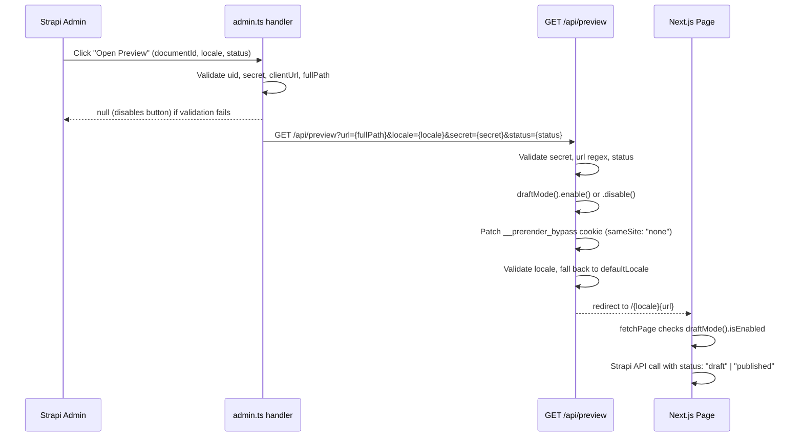

# Preview & Draft Mode

Two-part system: the Strapi admin generates a preview URL via a configured handler; the Next.js preview route enables draft mode and redirects to the content page. Only the `api::page.page` content type supports preview.

## Full Preview Flow



---

## Strapi Configuration

**File:** `apps/strapi/config/admin.ts`

| Config Key               | Env Var                       | Notes                                 |
| ------------------------ | ----------------------------- | ------------------------------------- |
| `enabled`                | `STRAPI_PREVIEW_ENABLED=true` | Must be string `"true"`.              |
| `previewSecret`          | `STRAPI_PREVIEW_SECRET`       | Shared with Next.js.                  |
| `allowedOrigins`         | `CLIENT_URL`                  | Origin allowed to receive preview.    |
| `enabledContentTypeUids` | —                             | Hardcoded: `["api::page.page"]` only. |

**Handler logic:**

```typescript title="apps/strapi/config/admin.ts"
handler: async (uid, { documentId, locale, status }) => {
  // Returns null (disables preview button) if:
  // - uid not in enabledContentTypeUids
  // - previewSecret is not set
  // - clientUrl is not set
  if (!enabledContentTypeUids.includes(uid) || !previewSecret || !clientUrl) {
    return null
  }

  const document = await strapi.documents(uid).findOne({ documentId, locale })
  const pathname = document?.fullPath

  // Returns null if document has no fullPath (e.g., page not yet saved)
  if (!pathname) return null

  const params = new URLSearchParams({ url: pathname, locale, secret, status })
  return `${clientUrl}/api/preview?${params}`
}
```

The handler fetches the document to read its `fullPath`. If `fullPath` is empty (the page has not been saved since hierarchy jobs ran), the button is disabled.

---

## Next.js Preview Route

**File:** `apps/ui/src/app/api/preview/route.ts`

GET handler at `/api/preview`. Accepts query params: `secret`, `url`, `status`, `locale`.

**Validation steps:**

| Param    | Validation                                 | On failure                            |
| -------- | ------------------------------------------ | ------------------------------------- |
| `secret` | Must match `STRAPI_PREVIEW_SECRET` env var | 401                                   |
| `url`    | Regex: `^(/[a-zA-Z0-9-%]*)+$`              | 404                                   |
| `status` | Must be `"draft"` or `"published"`         | Falls back to `"published"`           |
| `locale` | Must be in `routing.locales`               | Falls back to `routing.defaultLocale` |

**Draft mode toggle:**

```typescript title="apps/ui/src/app/api/preview/route.ts"
const dm = await draftMode()
if (status === "published") {
  dm.disable()
} else {
  dm.enable()
}
```

After the toggle, the cookie workaround runs (see below), then the handler redirects to the content URL with the validated locale.

---

## Cookie Workaround

:::warning[Known tech debt: cross-origin iframe cookie]
After `draftMode().enable()`, Next.js sets the `__prerender_bypass` cookie with `sameSite: "Lax"`. Cross-origin iframes (Strapi's preview panel) cannot read `sameSite: "Lax"` cookies. This means `draftMode().isEnabled` always returns `false` inside the preview iframe without this workaround.

The workaround manually re-sets the cookie with `sameSite: "none"`:

```typescript title="apps/ui/src/app/api/preview/route.ts"
const cookieStore = await cookies()
const draftCookie = cookieStore.get("__prerender_bypass")

cookieStore.set({
  name: "__prerender_bypass",
  value: draftCookie?.value || "",
  expires: draftCookie?.value ? undefined : 0,
  httpOnly: true,
  path: "/",
  secure: true,
  sameSite: "none", // Required for cross-origin iframe support
})
```

**Fragility:** This depends on the private cookie key `__prerender_bypass` which is an internal Next.js implementation detail. If Next.js renames this cookie in a future version, preview will silently break. This is a known limitation — see `CONCERNS.md` in the planning directory.
:::

---

## StrapiPreviewListener

Listens for live content updates from the Strapi preview panel and triggers a page refresh without a full reload.

### Server Component

**File:** `apps/ui/src/components/elementary/StrapiPreviewListener/index.tsx`

```typescript title="apps/ui/src/components/elementary/StrapiPreviewListener/index.tsx"
async function StrapiPreviewListener() {
  const strapiUrl = getEnvVar("STRAPI_URL")
  if (!strapiUrl) return null

  const previewSecret = Boolean(getEnvVar("STRAPI_PREVIEW_SECRET"))
  const strapiPreviewHashedOrigin = previewSecret
    ? await hashStringSHA256(strapiUrl)
    : undefined

  if (!previewSecret || !strapiPreviewHashedOrigin) return null

  return <StrapiPreviewWindowChangeListener hashedAllowedReloadOrigin={strapiPreviewHashedOrigin} />
}
```

The server component hashes `STRAPI_URL` with SHA-256 before passing it to the client component. This avoids leaking the Strapi URL into the client bundle while still allowing origin validation.

### Client Component

**File:** `apps/ui/src/components/elementary/StrapiPreviewListener/StrapiPreviewListener.tsx`

```typescript title="apps/ui/src/components/elementary/StrapiPreviewListener/StrapiPreviewListener.tsx"
useEffect(() => {
  const handleMessage = async (message: MessageEvent) => {
    if (
      message.data.type === "strapiUpdate" &&
      (await hashStringSHA256(message.origin)) === hashedAllowedReloadOrigin
    ) {
      router.refresh()
    }
  }
  window.addEventListener("message", handleMessage)
  return () => window.removeEventListener("message", handleMessage)
}, [hashedAllowedReloadOrigin])
```

On each `window.postMessage` event:

1. Checks `message.data.type === "strapiUpdate"` (cheap check first)
2. Hashes the event origin and compares against the pre-computed hash
3. Calls `router.refresh()` to re-fetch server components with current draft state

The component is mounted in the root layout (`apps/ui/src/app/[locale]/layout.tsx`) so it is active on all pages.

---

## Draft-Aware Fetching

`fetchPage` in `apps/ui/src/lib/strapi-api/content/server.ts` checks draft mode on every request:

```typescript
export async function fetchPage(fullPath, locale, requestInit?, options?) {
  const dm = await draftMode()
  try {
    return await PublicStrapiClient.fetchOneByFullPath(
      "api::page.page",
      fullPath,
      { locale, status: dm.isEnabled ? "draft" : "published", ... }
    )
  } catch (e) {
    logNonBlockingError({ message: `Error fetching page...`, error: e })
  }
}
```

When `draftMode().isEnabled` is `true` (set by the preview route), Strapi returns the draft version of the page. When `false`, Strapi returns the published version. See [API Client](../frontend/api-client.md) for the fetch client internals.

---

## Environment Variables

| Variable                 | Required for Preview | Notes                                     |
| ------------------------ | -------------------- | ----------------------------------------- |
| `STRAPI_PREVIEW_ENABLED` | Yes (Strapi)         | Set to `"true"`                           |
| `STRAPI_PREVIEW_SECRET`  | Yes (both)           | Must match in Strapi and Next.js          |
| `CLIENT_URL`             | Yes (Strapi)         | Next.js app origin                        |
| `STRAPI_URL`             | Yes (Next.js)        | Strapi origin for `StrapiPreviewListener` |
