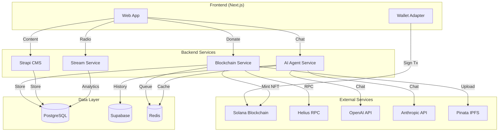

# New World Kids Platform - Brownfield Enhancement Architecture

**Version:** 1.0
**Date:** 2025-10-20
**Status:** Draft

---

## Change Log

| Date | Version | Description | Author |
|------|---------|-------------|--------|
| 2025-10-20 | 1.0 | Initial brownfield architecture for unified platform | BMAD Architect |

---

## 1. Introduction

This document outlines the architectural approach for transforming the Trail Mixx monorepo into the New World Kids nonprofit platform. Its primary goal is to serve as the guiding architectural blueprint for AI-driven development while ensuring seamless integration with the existing system.

### 1.1 Relationship to Existing Architecture

This document supplements the existing Trail Mixx architecture by defining how new components (blockchain, AI agents, nonprofit content) will integrate with current systems (Strapi CMS, Next.js web app, streaming service). Where conflicts arise between new and existing patterns, this document provides guidance on maintaining consistency while implementing enhancements.

### 1.2 Existing Project Analysis

#### Current Project State - Trail Mixx Monorepo

**Primary Purpose:** Community-focused internet radio station platform

**Current Tech Stack:**
- **Frontend:** Next.js 15.x + React 18 + TypeScript 5.x
- **Styling:** TailwindCSS v4 + Shadcn/ui
- **Backend:** Strapi v5 + PostgreSQL 13+
- **Services:** Node.js/Express (HLS proxy + analytics)
- **Mobile:** Capacitor 5.x
- **Monorepo:** Turborepo + Yarn workspaces
- **i18n:** next-intl (EN/ES)

**Architecture Style:** Monorepo with service-oriented architecture
- Apps and services communicate via REST APIs
- PostgreSQL as single source of truth
- Turborepo for build orchestration
- Docker for containerization

**Deployment Method:**
- Web: Vercel (Next.js app)
- CMS: Render (Strapi + PostgreSQL)
- Services: Render/Railway

#### Available Documentation

**Existing Documentation:**
- ✓ README.md - Comprehensive setup guide
- ✓ PROJECT_SUMMARY.md - Complete overview
- ✓ DESIGN_AUDIT.md - Design system and tokens
- ✓ MIGRATION_NOTES.md - File mappings from template migration
- ✓ CHANGELOG.md - Version history
- ✓ docs/compliance/ - Legal requirements for radio
- ✓ docs/spec-kit/ - Acceptance criteria
- ✓ docs/BMAD-Playbooks/ - Operational playbooks

#### Identified Constraints

**Technical Constraints:**
1. **Monorepo Structure:** Must maintain Turborepo workspace structure
2. **Database:** Single PostgreSQL database shared across services
3. **Strapi Version:** Locked to v5 (content types incompatible with v4)
4. **Next.js Version:** Must stay on v15 (App Router required)
5. **Mobile Apps:** Capacitor wrapper must remain compatible
6. **Existing Data:** Trail Mixx content (shows, tracks, merchants) must be preserved

**Operational Constraints:**
1. **Zero Downtime:** Migration must be phased (feature flags)
2. **Backward Compatibility:** Existing Trail Mixx URLs must redirect
3. **SEO Preservation:** Maintain existing search rankings where possible
4. **Cost:** Stay within budget ($200/month infrastructure)

**Security Constraints:**
1. **PCI Compliance:** Not required (crypto donations only)
2. **GDPR:** May apply if EU donors (plan for it)
3. **Nonprofit Status:** Requires transparent financial tracking

---

## 2. Enhancement Scope and Integration Strategy

### 2.1 Enhancement Overview

**Enhancement Type:** Major platform transformation + new feature integration

**Scope:**
- Rebrand Trail Mixx → New World Kids nonprofit platform
- Migrate UI/UX from Project #1 (Vite app)
- Add blockchain donation processing (Solana)
- Add NFT receipt generation (Metaplex)
- Implement real AI agents (OpenAI, Anthropic)
- Complete 4 empty pages (Dashboard, Impact Projects, Blockchain Tracker, AI Workforce)
- Add Strapi content types for nonprofit content
- Integrate Trail Mixx radio as one feature

**Integration Impact:** Significant
- 60% of codebase modified
- 2 new services added (blockchain, ai-agents)
- 5+ new Strapi content types
- Complete UI overhaul
- No breaking changes to existing services (stream, cms)

### 2.2 Integration Approach

**Code Integration Strategy:**
- **Rebranding:** Replace all "Trail Mixx" references with "New World Kids"
- **UI Migration:** Copy components from Project #1 → `apps/web/src/components/`
- **Route Reorganization:**
  - Trail Mixx radio: `/` → `/radio`
  - New World Kids home: `/` (new)
  - Feature flag: `ENABLE_NEW_BRANDING` for gradual rollout
- **Component Coexistence:** Both old and new components exist during migration

**Database Integration:**
- **Strategy:** Additive schema changes only (no deletions)
- **New Tables:**
  - `nwk_donations` - Blockchain donation records
  - `nwk_nft_receipts` - NFT metadata
  - `nwk_impact_projects` - Conservation projects
  - `nwk_user_perks` - Perk tracking
  - `nwk_blockchain_txns` - Transaction cache
  - `nwk_agent_conversations` - AI chat history
- **Existing Tables:** Preserved (shows, tracks, merchants for radio feature)
- **Namespace:** All new tables prefixed with `nwk_` to avoid conflicts

**API Integration:**
- **Strapi REST API:** Extended with new content types
  - `/api/blog-posts` (new)
  - `/api/impact-projects` (new)
  - `/api/wildlife` (new)
  - `/api/shows` (existing - for radio)
- **New Services:**
  - `services/blockchain/` → API on port 3002
  - `services/ai-agents/` → API on port 3003
- **API Gateway Pattern:** Next.js API routes proxy to backend services

**UI Integration:**
- **Design System:** Merge Project #1 gradients + Project #2 TailwindCSS v4
- **Component Library:** Extend shadcn/ui with tweakcn enhancements
- **Responsive:** Mobile-first (existing Trail Mixx pattern)
- **Accessibility:** Maintain WCAG 2.1 AA compliance

### 2.3 Compatibility Requirements

**Existing API Compatibility:**
- Trail Mixx streaming endpoints must remain functional (`/api/stream/*`)
- Strapi admin panel must continue working during migration
- Mobile apps must connect to new APIs without breaking

**Database Schema Compatibility:**
- No modifications to existing Trail Mixx tables
- Foreign keys only to new tables (no dependencies on old)
- Migrations are reversible (down migrations included)

**UI/UX Consistency:**
- Maintain existing design tokens where applicable
- Reuse existing shadcn/ui components
- Radio feature maintains familiar UX

**Performance Impact:**
- No degradation to existing page load times
- New blockchain APIs may be slower (acceptable for async operations)
- Database queries optimized (no N+1 problems)

---

## 3. Tech Stack

### 3.1 Existing Technology Stack

**Technologies to MAINTAIN:**

| Category | Current Technology | Version | Usage in Enhancement | Notes |
|----------|-------------------|---------|---------------------|-------|
| **Runtime** | Node.js | 20.x | All services | LTS version |
| **Framework** | Next.js | 15.x | Web app | App Router required |
| **Language** | TypeScript | 5.x | All code | Strict mode enabled |
| **CSS** | TailwindCSS | 4.x | Styling | Keep v4 features |
| **UI Library** | Shadcn/ui | Latest | Components | Extend with tweakcn |
| **CMS** | Strapi | 5.x | Content management | Add content types |
| **Database** | PostgreSQL | 13+ | Primary datastore | Add tables |
| **Monorepo** | Turborepo | 1.x | Build orchestration | Add new services |
| **Package Manager** | Yarn | 1.x | Dependencies | Keep for consistency |
| **Mobile** | Capacitor | 5.x | Native wrapper | Extend with new features |
| **i18n** | next-intl | 3.11+ | Internationalization | Extend to new pages |
| **Animation** | Framer Motion | 11.x | UI animations | Use for transitions |
| **State** | TanStack Query | 5.x | Server state | Use for data fetching |
| **HTTP Client** | Fetch API | Native | API calls | Built-in to Node 20 |
| **Forms** | React Hook Form | 7.x | Form management | Use for donation forms |
| **Validation** | Zod | 3.x | Schema validation | Type-safe validation |

### 3.2 New Technology Additions

**Technologies to ADD:**

| Technology | Version | Purpose | Rationale | Integration Method |
|-----------|---------|---------|-----------|-------------------|
| **tweakcn** | Latest | Design system enhancements | Optimal nonprofit UX patterns | Extends shadcn/ui config |
| **@solana/web3.js** | 1.87+ | Blockchain interaction | Solana donations | Client + server |
| **@solana/wallet-adapter-react** | 0.15+ | Wallet connection UI | User wallet integration | Client-side only |
| **@solana/spl-token** | 0.3+ | Token operations | SPL token donations (USDC) | Server-side |
| **@metaplex-foundation/js** | 0.20+ | NFT minting | NFT receipts | Server-side |
| **Supabase JS Client** | 2.38+ | Real-time database | User auth + live updates | Client + server |
| **OpenAI SDK** | 4.20+ | AI agents (GPT-4) | NovaSign, FlowAgent | Server-side only |
| **Anthropic SDK** | 0.9+ | AI agents (Claude) | EchoAgent, PulseAgent | Server-side only |
| **Three.js** | 0.160+ | 3D rendering | Animal viewer | Client-side only |
| **React Three Fiber** | 8.15+ | React wrapper for Three.js | Declarative 3D | Client-side only |
| **BullMQ** | 5.x | Job queue | NFT minting queue | Server-side |
| **Redis** | 7.x | Cache + queue backend | Performance + jobs | Server-side |
| **Mapbox GL** | 3.x | Interactive maps | Impact project locations | Client-side |
| **Helius RPC** | N/A | Solana RPC provider | Production blockchain access | API service |
| **Pinata SDK** | 2.x | IPFS uploads | NFT metadata storage | Server-side |

**Dependency Justification:**

1. **Blockchain Stack (Solana):**
   - Chosen for low transaction fees (<$0.01) vs Ethereum ($5-50)
   - Fast finality (400ms) for better UX
   - Growing nonprofit adoption

2. **AI Stack (OpenAI + Anthropic):**
   - OpenAI: Best for conversational agents (GPT-4)
   - Anthropic: Best for reasoning and factual accuracy (Claude)
   - Dual provider reduces risk of API outages

3. **Supabase vs Strapi:**
   - Supabase: Real-time features, authentication
   - Strapi: Content management, admin UI
   - Complementary, not competing

4. **Redis + BullMQ:**
   - NFT minting is slow (5-10 seconds)
   - Queue prevents timeout errors
   - Redis also used for caching AI responses

---

## 4. Data Models and Schema Changes

### 4.1 New Data Models

#### Model: Donation

**Purpose:** Record all blockchain donations with full transaction details

**Integration:** Links to Strapi users table and new impact_projects table

**Schema:**
```typescript
interface Donation {
  id: string;                    // UUID
  userId: string;                // FK to users table (nullable for anonymous)
  walletAddress: string;         // Solana wallet public key
  amount: number;                // Amount in lamports (SOL) or smallest unit
  currency: 'SOL' | 'USDC';      // Currency type
  usdValue: number;              // USD value at time of donation
  projectId?: string;            // FK to impact_projects (nullable for general fund)
  transactionHash: string;       // Solana transaction signature
  blockNumber: number;           // Solana slot number
  status: 'pending' | 'confirmed' | 'failed';
  nftReceiptId?: string;         // FK to nft_receipts (nullable if <$50)
  isAnonymous: boolean;          // Hide donor on leaderboard
  isRecurring: boolean;          // Part of recurring donation
  recurringPlanId?: string;      // FK to recurring_plans
  metadata: JSON;                // Additional data (referral source, campaign, etc.)
  createdAt: timestamp;
  confirmedAt?: timestamp;       // When transaction confirmed on blockchain
}
```

**Relationships:**
- **With Existing:** `users.id` (Strapi auth)
- **With New:** `impact_projects.id`, `nft_receipts.id`

**Indexes:**
- `idx_donations_user` on `userId`
- `idx_donations_txhash` on `transactionHash` (unique)
- `idx_donations_status` on `status`
- `idx_donations_created` on `createdAt`

---

#### Model: NFTReceipt

**Purpose:** Store metadata for minted NFT donation receipts

**Integration:** Links to donations and stores IPFS/Arweave URIs

**Schema:**
```typescript
interface NFTReceipt {
  id: string;                    // UUID
  donationId: string;            // FK to donations
  mintAddress: string;           // Solana NFT mint address
  tokenAccount: string;          // Owner's token account
  metadataUri: string;           // IPFS or Arweave URI
  metadata: {
    name: string;                // "New World Kids Donation Receipt #1234"
    symbol: string;              // "NWKDR"
    description: string;         // Donation details
    image: string;               // IPFS image URI
    attributes: Array<{          // Donation amount, date, project
      trait_type: string;
      value: string | number;
    }>;
  };
  mintingStatus: 'queued' | 'minting' | 'minted' | 'failed';
  mintTransactionHash?: string;  // Minting transaction signature
  mintedAt?: timestamp;
  createdAt: timestamp;
  updatedAt: timestamp;
}
```

**Relationships:**
- **With New:** `donations.id` (one-to-one)

**Indexes:**
- `idx_nft_mint` on `mintAddress` (unique)
- `idx_nft_donation` on `donationId` (unique)
- `idx_nft_status` on `mintingStatus`

---

#### Model: ImpactProject

**Purpose:** Conservation projects that users can donate to

**Integration:** Managed via Strapi CMS, referenced by donations

**Schema (Strapi Content Type):**
```typescript
interface ImpactProject {
  id: string;
  name: string;                  // "Save the Elephants - Kenya"
  slug: string;                  // "save-elephants-kenya"
  description: richText;         // Full project description
  shortDescription: text;        // One-liner for cards
  species: string[];             // ["African Elephant", "Rhinoceros"]
  location: {
    country: string;
    region: string;
    coordinates: {
      lat: number;
      lng: number;
    };
  };
  fundingGoal: number;           // Target in USD
  currentFunding: number;        // Calculated from donations
  status: 'active' | 'funded' | 'completed' | 'paused';
  startDate: date;
  endDate?: date;
  images: media[];               // Strapi media field
  featuredImage: media;          // Primary image
  updates: component[];          // Project updates (repeatable component)
  team: relation;                // Relation to team_members content type
  metrics: {
    animalsHelped: number;
    hectaresProtected: number;
    treesPlanted: number;
  };
  publishedAt: timestamp;
  createdAt: timestamp;
  updatedAt: timestamp;
  locale: string;                // i18n locale
}
```

**Strapi Configuration:**
- Internationalization: Enabled (EN, ES)
- Draft/Publish: Enabled
- API: Public read, admin write
- Permissions: Authenticated users can view all, admins can CRUD

---

#### Model: UserPerk

**Purpose:** Track user perks and rewards based on donation tiers

**Integration:** Links to users and defines perk unlock status

**Schema:**
```typescript
interface UserPerk {
  id: string;
  userId: string;                // FK to users
  perkType: 'early_access' | 'exclusive_content' | 'virtual_event' | 'physical_reward' | 'nft_badge';
  perkName: string;              // "Exclusive Webinar: Wildlife Conservation 101"
  perkDescription: text;
  tier: number;                  // 1-5 (donation tier required)
  unlockedAt: timestamp;
  status: 'locked' | 'unlocked' | 'claimed' | 'fulfilled';
  claimDeadline?: timestamp;     // Expiration for time-limited perks
  fulfillmentDetails?: JSON;     // Shipping address for physical rewards
  createdAt: timestamp;
  updatedAt: timestamp;
}
```

**Relationships:**
- **With Existing:** `users.id`

**Donation Tiers:**
- Tier 1: $10-49
- Tier 2: $50-99 (NFT receipt)
- Tier 3: $100-499 (Exclusive content)
- Tier 4: $500-999 (Virtual events)
- Tier 5: $1000+ (Physical rewards)

---

#### Model: BlockchainTransaction

**Purpose:** Cache of blockchain transactions for fast querying

**Integration:** Synced from Solana blockchain, denormalized for performance

**Schema:**
```typescript
interface BlockchainTransaction {
  id: string;
  signature: string;             // Solana transaction signature (unique)
  blockNumber: number;           // Slot number
  timestamp: timestamp;          // Block timestamp
  type: 'donation' | 'nft_mint' | 'token_transfer';
  fromAddress: string;           // Source wallet
  toAddress: string;             // Destination wallet
  amount: number;                // Amount transferred
  currency: string;              // SOL, USDC, etc.
  donationId?: string;           // FK to donations
  status: 'pending' | 'confirmed' | 'failed';
  fee: number;                   // Transaction fee in lamports
  programId?: string;            // Program used (if applicable)
  rawData: JSON;                 // Full transaction data from Solana
  createdAt: timestamp;
  syncedAt: timestamp;           // Last time synced from blockchain
}
```

**Relationships:**
- **With New:** `donations.id` (nullable)

**Indexes:**
- `idx_btx_signature` on `signature` (unique)
- `idx_btx_type` on `type`
- `idx_btx_timestamp` on `timestamp` (DESC)

**Sync Strategy:**
- Webhook from Helius RPC on new transactions
- Fallback: Polling every 30 seconds
- Only store relevant transactions (donations to our wallet)

---

#### Model: AgentConversation

**Purpose:** Store AI agent chat history for continuity and analytics

**Integration:** Supabase for real-time features

**Schema (Supabase Table):**
```typescript
interface AgentConversation {
  id: string;
  userId: string;                // FK to users
  agentType: 'nova_sign' | 'echo_agent' | 'flow_agent' | 'pulse_agent';
  messages: Array<{
    role: 'user' | 'agent';
    content: string;
    timestamp: timestamp;
  }>;
  context: JSON;                 // Context passed to agent (project info, user donations, etc.)
  tokensUsed: number;            // For cost tracking
  startedAt: timestamp;
  lastMessageAt: timestamp;
  createdAt: timestamp;
}
```

**Relationships:**
- **With Existing:** `users.id`

**Supabase Real-time:**
- Subscribe to user's conversations for live updates
- Row-level security: Users can only read their own conversations

---

### 4.2 Schema Integration Strategy

**Database Changes Required:**

**New Tables (PostgreSQL):**
```sql
-- Managed by Strapi migrations
CREATE TABLE nwk_donations (...);
CREATE TABLE nwk_nft_receipts (...);
CREATE TABLE nwk_user_perks (...);
CREATE TABLE nwk_blockchain_txns (...);

-- Strapi content types (auto-generated)
CREATE TABLE impact_projects (...);
CREATE TABLE impact_projects_localizations (...);
CREATE TABLE blog_posts (...);
CREATE TABLE blog_posts_localizations (...);
CREATE TABLE wildlife (...);
CREATE TABLE wildlife_localizations (...);

-- Supabase (separate database)
CREATE TABLE agent_conversations (...);
```

**Modified Tables:** None (additive only)

**New Indexes:**
```sql
CREATE INDEX idx_donations_user ON nwk_donations(user_id);
CREATE INDEX idx_donations_txhash ON nwk_donations(transaction_hash);
CREATE INDEX idx_donations_status ON nwk_donations(status);
CREATE INDEX idx_nft_mint ON nwk_nft_receipts(mint_address) UNIQUE;
CREATE INDEX idx_btx_signature ON nwk_blockchain_txns(signature) UNIQUE;
CREATE INDEX idx_btx_timestamp ON nwk_blockchain_txns(timestamp DESC);
```

**Migration Strategy:**

1. **Phase 1:** Create new tables (zero risk)
2. **Phase 2:** Deploy new services (blockchain, ai-agents)
3. **Phase 3:** Deploy updated web app (feature flagged)
4. **Phase 4:** Enable new features gradually

**Backward Compatibility:**
- All new tables use `nwk_` prefix (no collisions)
- No foreign keys from old tables to new tables
- Old Trail Mixx features unaffected

---

## 5. Component Architecture

### 5.1 New Components

#### Component: Blockchain Service

**Responsibility:** Handle all Solana blockchain interactions (donations, NFT minting, transaction tracking)

**Integration Points:**
- Receives donation requests from Next.js API routes
- Stores transaction records in PostgreSQL
- Queues NFT minting jobs in BullMQ/Redis
- Sends webhooks to Strapi on donation confirmation

**Key Interfaces:**
```typescript
// POST /api/blockchain/donate
interface DonateRequest {
  walletAddress: string;
  amount: number;
  currency: 'SOL' | 'USDC';
  projectId?: string;
  userId?: string;
}

interface DonateResponse {
  transactionHash: string;
  status: 'pending' | 'confirmed';
  donationId: string;
  estimatedConfirmationTime: number; // seconds
}

// POST /api/blockchain/mint-nft
interface MintNFTRequest {
  donationId: string;
  recipientAddress: string;
}

interface MintNFTResponse {
  jobId: string;              // BullMQ job ID
  status: 'queued';
  estimatedMintTime: number;  // seconds
}

// GET /api/blockchain/transaction/:hash
interface GetTransactionResponse {
  signature: string;
  status: 'pending' | 'confirmed' | 'failed';
  blockNumber: number;
  timestamp: timestamp;
  amount: number;
  currency: string;
}
```

**Dependencies:**
- **Existing:** PostgreSQL (via Strapi connection pool)
- **New:** Helius RPC, Metaplex SDK, Redis, BullMQ

**Technology Stack:**
- Node.js/Express
- TypeScript
- @solana/web3.js
- @metaplex-foundation/js
- BullMQ for job queue
- Prisma for database (separate from Strapi)

**File Structure:**
```
services/blockchain/
├── src/
│   ├── index.ts                 # Express server
│   ├── routes/
│   │   ├── donate.ts
│   │   ├── mint-nft.ts
│   │   └── transaction.ts
│   ├── services/
│   │   ├── solana-service.ts    # Core Solana interactions
│   │   ├── nft-minter.ts        # NFT minting logic
│   │   └── transaction-tracker.ts
│   ├── workers/
│   │   └── nft-worker.ts        # BullMQ worker for minting
│   ├── utils/
│   │   ├── wallet.ts            # Wallet management
│   │   └── metadata.ts          # NFT metadata generation
│   └── config/
│       └── solana.ts            # RPC endpoints, program IDs
├── prisma/
│   └── schema.prisma            # Database schema
├── package.json
└── Dockerfile
```

---

#### Component: AI Agent Service

**Responsibility:** Provide conversational AI agents with context about donations, projects, and Web3 education

**Integration Points:**
- Receives chat messages from Next.js API routes
- Fetches user donation history from blockchain service
- Fetches project information from Strapi API
- Stores conversation history in Supabase
- Implements rate limiting per user

**Key Interfaces:**
```typescript
// POST /api/agents/:agentType/chat
interface ChatRequest {
  userId: string;
  message: string;
  conversationId?: string;  // Resume existing conversation
}

interface ChatResponse {
  conversationId: string;
  message: string;
  agentType: string;
  tokensUsed: number;
  timestamp: timestamp;
}

// GET /api/agents/:agentType/context
interface AgentContext {
  userDonations: Donation[];
  activeProjects: ImpactProject[];
  userPerks: UserPerk[];
  totalImpact: {
    animalsHelped: number;
    treesPlanted: number;
  };
}
```

**Agent Implementations:**

1. **NovaSign** (Web3 Educator)
   - Model: OpenAI GPT-4
   - Persona: Friendly Web3 teacher
   - Context: Wallet basics, blockchain concepts, NFTs
   - System Prompt: "You are NovaSign, a friendly Web3 educator..."

2. **EchoAgent** (Conservation Expert)
   - Model: Anthropic Claude 3 Opus
   - Persona: Wildlife conservation expert
   - Context: Impact projects, species information, conservation strategies
   - System Prompt: "You are EchoAgent, a wildlife conservation expert..."

3. **FlowAgent** (Donation Advisor)
   - Model: OpenAI GPT-4
   - Persona: Financial advisor for charitable giving
   - Context: User donation history, tax implications, matching campaigns
   - System Prompt: "You are FlowAgent, a charitable giving advisor..."

4. **PulseAgent** (Impact Tracker)
   - Model: Anthropic Claude 3 Opus
   - Persona: Data analyst and impact storyteller
   - Context: Real-time donation data, project metrics, user's personal impact
   - System Prompt: "You are PulseAgent, an impact analyst..."

**Dependencies:**
- **New:** OpenAI SDK, Anthropic SDK, Supabase client, Redis (caching)

**Technology Stack:**
- Node.js/Express
- TypeScript
- OpenAI SDK
- Anthropic SDK
- Rate limiting (express-rate-limit)
- Caching (Redis)

**File Structure:**
```
services/ai-agents/
├── src/
│   ├── index.ts
│   ├── routes/
│   │   └── chat.ts
│   ├── agents/
│   │   ├── base-agent.ts        # Abstract base class
│   │   ├── nova-sign.ts
│   │   ├── echo-agent.ts
│   │   ├── flow-agent.ts
│   │   └── pulse-agent.ts
│   ├── services/
│   │   ├── openai-service.ts
│   │   ├── anthropic-service.ts
│   │   └── context-builder.ts   # Fetch user context
│   ├── middleware/
│   │   └── rate-limit.ts
│   └── config/
│       └── agents.ts            # Agent configurations
├── package.json
└── Dockerfile
```

---

#### Component: Blockchain SDK (Shared Package)

**Responsibility:** Reusable utilities for blockchain operations across services and web app

**Integration Points:**
- Used by blockchain service (server-side)
- Used by Next.js app (client-side wallet connection)
- Provides type-safe interfaces

**Key Exports:**
```typescript
// Wallet utilities
export function formatWalletAddress(address: string, length?: number): string;
export function validateSolanaAddress(address: string): boolean;

// Transaction utilities
export function formatLamports(lamports: number): string; // "1.5 SOL"
export function lamportsToUSD(lamports: number, price: number): number;

// Explorer links
export function getExplorerUrl(signature: string, network: 'mainnet' | 'testnet'): string;

// Types
export interface WalletContextType {
  publicKey: PublicKey | null;
  connected: boolean;
  connecting: boolean;
  connect: () => Promise<void>;
  disconnect: () => Promise<void>;
}
```

**Dependencies:**
- **New:** @solana/web3.js

**Technology Stack:**
- TypeScript (pure utilities, no framework)
- Shared across client and server

**File Structure:**
```
packages/blockchain-sdk/
├── src/
│   ├── index.ts
│   ├── wallet/
│   │   ├── format.ts
│   │   └── validate.ts
│   ├── transaction/
│   │   ├── format.ts
│   │   └── utils.ts
│   ├── explorer/
│   │   └── links.ts
│   └── types/
│       └── index.ts
├── package.json
└── tsconfig.json
```

---

### 5.2 Component Interaction Diagram



**Data Flow: Donation Process**

1. User connects wallet (Phantom) → WalletAdapter
2. User submits donation form → Next.js API route
3. Next.js API → Blockchain Service `/api/donate`
4. Blockchain Service creates transaction → Helius RPC → Solana
5. Transaction confirmed → Blockchain Service stores in PostgreSQL
6. If donation ≥$50 → Queue NFT minting job (Redis/BullMQ)
7. NFT Worker mints NFT → Metaplex → Solana
8. NFT metadata uploaded → IPFS (Pinata)
9. NFT record stored → PostgreSQL
10. Webhook sent to Strapi → Update project funding
11. Real-time update → Supabase → Next.js (live donation feed)

---

## 6. API Design and Integration

### 6.1 API Integration Strategy

**API Architecture:** Microservices with Next.js API routes as gateway

**Authentication:**
- Strapi JWT for CMS-authenticated users
- Supabase JWT for real-time features
- Wallet signature for blockchain operations (cryptographic auth)

**Versioning:** None initially (v1 implied), future API versioning via `/api/v2/...`

**Rate Limiting:**
- Global: 100 requests/minute per IP
- Authenticated: 1000 requests/minute per user
- AI agents: 10 messages/hour per user
- Blockchain: 20 transactions/hour per wallet

### 6.2 New API Endpoints

#### Endpoint: Process Donation

**Purpose:** Initiate blockchain donation transaction

- **Method:** POST
- **Endpoint:** `/api/blockchain/donate`
- **Integration:** Proxies to blockchain service, stores in Strapi

**Request:**
```json
{
  "walletAddress": "7xKXtg2CW87d97TXJSDpbD5jBkheTqA83TZRuJosgAsU",
  "amount": 1.5,
  "currency": "SOL",
  "projectId": "uuid-123",
  "isAnonymous": false,
  "userId": "uuid-456"
}
```

**Response (Success):**
```json
{
  "success": true,
  "data": {
    "donationId": "uuid-789",
    "transactionHash": "5J8w...",
    "status": "pending",
    "estimatedConfirmationTime": 30,
    "nftEligible": false
  }
}
```

**Response (Error):**
```json
{
  "success": false,
  "error": {
    "code": "INSUFFICIENT_FUNDS",
    "message": "Wallet balance too low to complete donation",
    "details": {
      "required": 1.5,
      "available": 1.2
    }
  }
}
```

---

#### Endpoint: Mint NFT Receipt

**Purpose:** Queue NFT minting for eligible donations

- **Method:** POST
- **Endpoint:** `/api/blockchain/mint-nft`
- **Integration:** Adds job to BullMQ, returns job ID

**Request:**
```json
{
  "donationId": "uuid-789",
  "recipientAddress": "7xKXtg2CW87d97TXJSDpbD5jBkheTqA83TZRuJosgAsU"
}
```

**Response:**
```json
{
  "success": true,
  "data": {
    "jobId": "nft-job-123",
    "status": "queued",
    "position": 3,
    "estimatedMintTime": 120
  }
}
```

---

#### Endpoint: AI Agent Chat

**Purpose:** Send message to AI agent and receive response

- **Method:** POST
- **Endpoint:** `/api/agents/:agentType/chat`
- **Integration:** Proxies to AI agent service, stores in Supabase

**Request:**
```json
{
  "userId": "uuid-456",
  "conversationId": "conv-123",
  "message": "How does blockchain donation work?"
}
```

**Response:**
```json
{
  "success": true,
  "data": {
    "conversationId": "conv-123",
    "agentType": "nova_sign",
    "message": "Great question! Blockchain donations work by...",
    "timestamp": "2025-10-20T10:30:00Z",
    "tokensUsed": 234
  }
}
```

---

#### Endpoint: Get Impact Projects

**Purpose:** Fetch all impact projects from Strapi

- **Method:** GET
- **Endpoint:** `/api/impact-projects`
- **Integration:** Queries Strapi REST API

**Query Parameters:**
- `status` - Filter by status (active, funded, completed)
- `species` - Filter by species
- `locale` - Language (en, es)
- `page` - Pagination
- `pageSize` - Results per page

**Response:**
```json
{
  "success": true,
  "data": [
    {
      "id": "uuid-proj-1",
      "name": "Save the Elephants - Kenya",
      "slug": "save-elephants-kenya",
      "shortDescription": "Protecting elephant habitats...",
      "species": ["African Elephant"],
      "location": {
        "country": "Kenya",
        "coordinates": { "lat": -1.286389, "lng": 36.817223 }
      },
      "fundingGoal": 50000,
      "currentFunding": 32450,
      "status": "active",
      "featuredImage": { "url": "https://..." }
    }
  ],
  "meta": {
    "page": 1,
    "pageSize": 10,
    "total": 15
  }
}
```

---

## 7. Source Tree

### 7.1 Existing Project Structure (Trail Mixx)

```plaintext
strapi-template-new-world-kids/
├── apps/
│   ├── web/                     # Next.js 15 frontend
│   │   ├── src/
│   │   │   ├── app/
│   │   │   │   ├── [locale]/   # i18n routing
│   │   │   │   │   ├── listen/ # Trail Mixx radio page
│   │   │   │   │   └── page.tsx
│   │   │   │   └── api/        # API routes
│   │   │   ├── components/     # Existing components
│   │   │   └── lib/
│   │   └── public/
│   └── mobile/                  # Capacitor wrapper
├── services/
│   ├── cms/                     # Strapi v5
│   │   ├── src/
│   │   │   └── api/
│   │   │       ├── show/       # Trail Mixx content types
│   │   │       ├── track/
│   │   │       └── merchant/
│   │   └── database/
│   └── stream/                  # HLS proxy
└── packages/
    ├── player-sdk/              # Trail Mixx player
    └── design-system/
```

### 7.2 New File Organization

```plaintext
strapi-template-new-world-kids/
├── apps/
│   ├── web/                     # Next.js 15 frontend
│   │   ├── src/
│   │   │   ├── app/
│   │   │   │   ├── [locale]/
│   │   │   │   │   ├── (marketing)/           # NEW: Public pages
│   │   │   │   │   │   ├── page.tsx           # NEW: Home page
│   │   │   │   │   │   ├── donate/
│   │   │   │   │   │   │   └── page.tsx       # NEW: Donation page
│   │   │   │   │   │   ├── blog/
│   │   │   │   │   │   │   ├── page.tsx       # NEW: Blog list
│   │   │   │   │   │   │   └── [slug]/
│   │   │   │   │   │   │       └── page.tsx   # NEW: Blog post
│   │   │   │   │   │   ├── radio/
│   │   │   │   │   │   │   └── page.tsx       # MOVED: From /listen
│   │   │   │   │   │   └── layout.tsx         # NEW: Marketing layout
│   │   │   │   │   ├── (platform)/            # NEW: Authenticated pages
│   │   │   │   │   │   ├── dashboard/
│   │   │   │   │   │   │   └── page.tsx       # NEW: User dashboard
│   │   │   │   │   │   ├── impact-projects/
│   │   │   │   │   │   │   ├── page.tsx       # NEW: Project list
│   │   │   │   │   │   │   └── [id]/
│   │   │   │   │   │   │       └── page.tsx   # NEW: Project detail
│   │   │   │   │   │   ├── blockchain-tracker/
│   │   │   │   │   │   │   └── page.tsx       # NEW: Transaction explorer
│   │   │   │   │   │   ├── ai-workforce/
│   │   │   │   │   │   │   └── page.tsx       # NEW: AI agents hub
│   │   │   │   │   │   └── layout.tsx         # NEW: Platform layout
│   │   │   │   │   └── layout.tsx             # Root locale layout
│   │   │   │   └── api/                       # API routes
│   │   │   │       ├── blockchain/            # NEW: Blockchain proxy
│   │   │   │       │   ├── donate/
│   │   │   │       │   ├── mint-nft/
│   │   │   │       │   └── transaction/[hash]/
│   │   │   │       ├── agents/                # NEW: AI agent proxy
│   │   │   │       │   └── [agentType]/
│   │   │   │       │       └── chat/
│   │   │   │       └── [...existing]/
│   │   │   ├── components/                    # NEW: Migrated from Project #1
│   │   │   │   ├── ui/                        # shadcn/ui + tweakcn
│   │   │   │   │   ├── button.tsx
│   │   │   │   │   ├── card.tsx
│   │   │   │   │   └── [...50+ components]
│   │   │   │   ├── home/                      # Home page sections
│   │   │   │   │   ├── hero.tsx
│   │   │   │   │   ├── features.tsx
│   │   │   │   │   └── testimonials.tsx
│   │   │   │   ├── donation/                  # Donation flow
│   │   │   │   │   ├── donation-form.tsx
│   │   │   │   │   ├── donation-tiers.tsx
│   │   │   │   │   ├── impact-preview.tsx
│   │   │   │   │   └── recent-donors.tsx
│   │   │   │   ├── blockchain/                # Web3 components
│   │   │   │   │   ├── wallet-button.tsx
│   │   │   │   │   ├── transaction-list.tsx
│   │   │   │   │   └── nft-gallery.tsx
│   │   │   │   ├── agents/                    # AI agent chat
│   │   │   │   │   ├── agent-chat.tsx
│   │   │   │   │   └── agent-card.tsx
│   │   │   │   ├── layout/                    # Layout components
│   │   │   │   │   ├── navbar.tsx
│   │   │   │   │   └── footer.tsx
│   │   │   │   └── [...existing Trail Mixx]
│   │   │   ├── lib/                           # Utilities
│   │   │   │   ├── blockchain/                # NEW: Blockchain utilities
│   │   │   │   │   ├── solana-client.ts
│   │   │   │   │   └── wallet-adapter.tsx
│   │   │   │   ├── supabase/                  # NEW: Supabase client
│   │   │   │   │   └── client.ts
│   │   │   │   ├── strapi/                    # NEW: Strapi client
│   │   │   │   │   └── client.ts
│   │   │   │   └── utils.ts
│   │   │   └── hooks/                         # Custom React hooks
│   │   │       ├── use-wallet.ts              # NEW: Wallet hook
│   │   │       ├── use-agent.ts               # NEW: Agent hook
│   │   │       └── use-donations.ts           # NEW: Donations hook
│   │   ├── public/
│   │   │   ├── nft-templates/                 # NEW: NFT images
│   │   │   └── animals/                       # NEW: 3D models
│   │   ├── tailwind.config.ts                 # UPDATED: Merge configs
│   │   └── package.json
│   └── mobile/                                 # Capacitor wrapper
│       └── [existing]
├── services/
│   ├── cms/                                    # Strapi v5
│   │   ├── src/
│   │   │   └── api/
│   │   │       ├── blog-post/                 # NEW: Blog content type
│   │   │       ├── impact-project/            # NEW: Projects
│   │   │       ├── wildlife/                  # NEW: Wildlife info
│   │   │       ├── team-member/               # NEW: Team
│   │   │       ├── testimonial/               # NEW: Testimonials
│   │   │       └── [...existing: show, track, merchant]
│   │   └── database/
│   │       └── migrations/                    # NEW: DB migrations
│   ├── stream/                                 # HLS proxy (existing)
│   ├── blockchain/                            # NEW: Blockchain service
│   │   ├── src/
│   │   │   ├── index.ts
│   │   │   ├── routes/
│   │   │   │   ├── donate.ts
│   │   │   │   ├── mint-nft.ts
│   │   │   │   └── transaction.ts
│   │   │   ├── services/
│   │   │   │   ├── solana-service.ts
│   │   │   │   ├── nft-minter.ts
│   │   │   │   └── transaction-tracker.ts
│   │   │   ├── workers/
│   │   │   │   └── nft-worker.ts
│   │   │   └── config/
│   │   ├── prisma/
│   │   │   └── schema.prisma
│   │   ├── Dockerfile
│   │   └── package.json
│   └── ai-agents/                             # NEW: AI agent service
│       ├── src/
│       │   ├── index.ts
│       │   ├── routes/
│       │   │   └── chat.ts
│       │   ├── agents/
│       │   │   ├── base-agent.ts
│       │   │   ├── nova-sign.ts
│       │   │   ├── echo-agent.ts
│       │   │   ├── flow-agent.ts
│       │   │   └── pulse-agent.ts
│       │   ├── services/
│       │   │   ├── openai-service.ts
│       │   │   ├── anthropic-service.ts
│       │   │   └── context-builder.ts
│       │   └── config/
│       ├── Dockerfile
│       └── package.json
├── packages/
│   ├── player-sdk/                            # Trail Mixx player
│   ├── design-system/                         # Shared design tokens
│   │   └── tokens/                            # UPDATED: New colors
│   └── blockchain-sdk/                        # NEW: Blockchain utilities
│       ├── src/
│       │   ├── wallet/
│       │   ├── transaction/
│       │   └── types/
│       └── package.json
├── docs/
│   ├── brownfield-prd.md                      # NEW: This PRD
│   ├── brownfield-architecture.md             # NEW: This document
│   └── [...existing Trail Mixx docs]
├── turbo.json                                  # UPDATED: New tasks
└── package.json                                # UPDATED: New scripts
```

### 7.3 Integration Guidelines

**File Naming:**
- Components: PascalCase (`DonationForm.tsx`)
- Utilities: camelCase (`formatWalletAddress.ts`)
- API routes: kebab-case (`process-donation/route.ts`)

**Folder Organization:**
- Group by feature, not by type
- Colocate tests with components (`DonationForm.test.tsx`)
- Shared utilities in `lib/`

**Import/Export Patterns:**
- Use barrel exports (`components/ui/index.ts`)
- Absolute imports with `@/` alias
- Named exports preferred over default exports

---

## 8. Infrastructure and Deployment Integration

### 8.1 Existing Infrastructure (Trail Mixx)

**Current Deployment:**
- **Web App:** Vercel (Next.js automatic deployment)
- **Strapi CMS:** Render (Docker container)
- **PostgreSQL:** Render managed database
- **Stream Service:** Render (Node.js service)

**Infrastructure Tools:**
- Docker for containerization
- GitHub Actions for CI/CD
- Vercel for web hosting
- Render for backend services

**Environments:**
- Development: Local (Docker Compose)
- Staging: Render preview deployments
- Production: Vercel (web) + Render (services)

### 8.2 Enhancement Deployment Strategy

**New Services Deployment:**

1. **Blockchain Service:**
   - Platform: Railway or Render
   - Container: Docker
   - Port: 3002
   - Environment: All Solana RPC credentials

2. **AI Agent Service:**
   - Platform: Railway or Render
   - Container: Docker
   - Port: 3003
   - Environment: OpenAI + Anthropic API keys

3. **Redis:**
   - Platform: Upstash (serverless) or Render managed Redis
   - Usage: BullMQ queue + caching
   - Max memory: 256MB (sufficient for job queue)

**Deployment Workflow:**

```yaml
# GitHub Actions workflow
name: Deploy New World Kids

on:
  push:
    branches: [main]

jobs:
  deploy-web:
    runs-on: ubuntu-latest
    steps:
      - uses: actions/checkout@v3
      - name: Deploy to Vercel
        run: vercel --prod

  deploy-blockchain:
    runs-on: ubuntu-latest
    steps:
      - uses: actions/checkout@v3
      - name: Build Docker image
        run: docker build -t blockchain-service ./services/blockchain
      - name: Deploy to Render
        run: render deploy --service blockchain

  deploy-ai-agents:
    runs-on: ubuntu-latest
    steps:
      - uses: actions/checkout@v3
      - name: Build Docker image
        run: docker build -t ai-agents-service ./services/ai-agents
      - name: Deploy to Render
        run: render deploy --service ai-agents
```

**Pipeline Integration:**
- Turborepo builds all services in parallel
- E2E tests run before deployment
- Vercel preview deployments for PRs
- Rollback via Git revert + redeploy

### 8.3 Rollback Strategy

**Rollback Method:**
- Git-based: Revert commit → redeploy
- Docker tags: Rollback to previous image
- Feature flags: Disable new features without redeployment

**Risk Mitigation:**
- Database migrations are reversible (down migrations)
- Feature flags for gradual rollout
- Canary deployments (10% traffic → 50% → 100%)

**Monitoring:**
- Vercel Analytics for frontend performance
- Sentry for error tracking
- Custom dashboards for donation/blockchain metrics
- Uptime monitoring (Better Uptime or similar)

---

## 9. Coding Standards

### 9.1 Existing Standards Compliance

**Code Style (from Trail Mixx):**
- TypeScript strict mode
- ESLint extends: `@repo/eslint-config`
- Prettier: 2-space indentation, single quotes
- Line length: 100 characters

**Linting Rules:**
- `no-console` in production code
- `no-unused-vars` enforced
- `import/order` for organized imports

**Testing Patterns:**
- Jest for unit tests
- Playwright for E2E tests (to be added)
- Coverage target: 80% for critical paths

**Documentation Style:**
- JSDoc for public functions
- README.md in every service/package
- ADRs (Architecture Decision Records) for major decisions

### 9.2 Enhancement-Specific Standards

**Blockchain Code Standards:**
- Always validate wallet addresses before transactions
- Use try-catch for all blockchain operations
- Log transaction hashes for debugging
- Never expose private keys (use environment variables)

**AI Agent Code Standards:**
- Implement token usage tracking for cost monitoring
- Cache frequent responses (Redis)
- Rate limit aggressively (10 msgs/hour)
- Sanitize user input before sending to AI APIs

**Error Handling Standards:**
```typescript
// Good: Structured error with context
throw new BlockchainError('INSUFFICIENT_FUNDS', {
  required: amount,
  available: balance,
  wallet: publicKey.toString()
});

// Bad: Generic error
throw new Error('Not enough money');
```

**Logging Standards:**
```typescript
// Good: Structured JSON logging
logger.info('Donation processed', {
  donationId,
  amount,
  currency,
  transactionHash,
  userId
});

// Bad: String concatenation
console.log(`Donation ${donationId} processed`);
```

### 9.3 Critical Integration Rules

**Database Integrity:**
- Use transactions for multi-table operations
- Always include foreign key constraints
- Soft delete (status field) instead of hard delete for donations
- Encrypt sensitive data (wallet private keys if ever stored)

**API Security:**
- Validate all inputs with Zod schemas
- Sanitize user-generated content
- Rate limit all endpoints
- Use CORS whitelist (not wildcard)

**Performance:**
- Paginate all list endpoints (max 100 items)
- Use database indexes on frequently queried fields
- Cache expensive operations (Redis, 5-minute TTL)
- Optimize images (Next.js Image component)

---

## 10. Testing Strategy

### 10.1 Integration with Existing Tests

**Existing Test Framework (Trail Mixx):**
- Jest for unit tests
- React Testing Library for component tests
- Test organization: Colocated with components

**Coverage Requirements:**
- Existing: 60% overall coverage
- Target: 80% for new code

### 10.2 New Testing Requirements

#### Unit Tests for New Components

**Framework:** Jest + React Testing Library

**Location:** `apps/web/src/components/**/__tests__/`

**Coverage Target:** 90% for critical components (donation flow, wallet connection)

**Example Test Structure:**
```typescript
// DonationForm.test.tsx
describe('DonationForm', () => {
  it('should validate amount input', () => {
    // Test validation logic
  });

  it('should call onSubmit with correct data', () => {
    // Test form submission
  });

  it('should show loading state during transaction', () => {
    // Test async behavior
  });
});
```

#### Integration Tests

**Scope:**
- API route testing (Next.js API routes)
- Database operations (Prisma + Strapi)
- Service-to-service communication

**Tools:**
- Supertest for API testing
- Test database (Docker container)

**Example:**
```typescript
// donate.integration.test.ts
describe('POST /api/blockchain/donate', () => {
  it('should create donation record in database', async () => {
    const response = await request(app)
      .post('/api/blockchain/donate')
      .send({ walletAddress: '...', amount: 1.5 });

    expect(response.status).toBe(200);
    expect(response.body.donationId).toBeDefined();

    // Verify database record
    const donation = await prisma.donation.findUnique({
      where: { id: response.body.donationId }
    });
    expect(donation).toBeDefined();
  });
});
```

#### Regression Testing

**Existing Feature Verification:**
- Trail Mixx radio must still stream audio
- Strapi admin panel must remain functional
- Mobile apps must continue working

**Automated Regression Suite:**
- Run on every PR
- Tests critical user flows (radio playback, CMS login)
- Visual regression tests for UI components (Percy or Chromatic)

---

## 11. Security Integration

### 11.1 Existing Security Measures (Trail Mixx)

**Authentication:**
- Strapi JWT tokens for CMS users
- HTTP-only cookies
- Token expiration: 7 days

**Authorization:**
- Role-based access control (RBAC) in Strapi
- Public vs authenticated content

**Data Protection:**
- HTTPS enforced
- Environment variables for secrets
- Database connection strings encrypted

**Security Tools:**
- Dependabot for dependency updates
- GitHub security scanning

### 11.2 Enhancement Security Requirements

**Blockchain Security:**
- Wallet private keys stored in environment variables (never in code)
- Transaction signing on client-side only (user's wallet)
- Server-side validation of all transaction parameters
- Rate limiting on donation endpoints (20 tx/hour per wallet)

**NFT Minting Security:**
- Minting wallet separate from donation receiving wallet
- NFT metadata validated before IPFS upload
- Queue processing prevents DoS via minting spam

**AI Agent Security:**
- Input sanitization (prevent prompt injection)
- Output filtering (no leaking of PII)
- Rate limiting (10 messages/hour per user)
- Cost caps ($500/month total API spend)

**API Security:**
- All endpoints use Zod validation
- CORS whitelist (only allow newworldkids.org)
- Rate limiting per IP and per user
- SQL injection prevention (Prisma parameterized queries)

### 11.3 Security Testing

**Penetration Testing:**
- OWASP Top 10 vulnerability scanning (Semgrep)
- Dependency vulnerability scanning (Snyk)
- Manual security review before launch

**Compliance:**
- GDPR (if EU donors): Cookie consent, data export, right to deletion
- CCPA (if CA donors): Privacy policy, opt-out mechanism
- Nonprofit transparency: Public donation ledger (anonymized)

---

## 12. Checklist Results Report

*(To be completed after running `architect-checklist` from BMAD-METHOD)*

**Checklist Status:** Pending

**Key Validation Points:**
- [ ] PRD alignment verified
- [ ] All integration points documented
- [ ] Database schema validated
- [ ] API contracts defined
- [ ] Security measures documented
- [ ] Testing strategy complete
- [ ] Deployment plan validated

---

## 13. Next Steps

### 13.1 Story Manager Handoff

**Prompt for Story Manager (SM Agent):**

```
You are tasked with creating implementation stories for the New World Kids brownfield enhancement.

**Context:**
- PRD: docs/brownfield-prd.md
- Architecture: docs/brownfield-architecture.md
- Existing Project: Trail Mixx monorepo (Next.js + Strapi)
- Enhancement: Transform to New World Kids nonprofit platform

**Key Integration Requirements:**
- Maintain existing Trail Mixx services (stream, cms)
- Add new services (blockchain, ai-agents)
- Namespace all new database tables with `nwk_` prefix
- Use feature flags for gradual rollout
- Ensure backward compatibility

**First Epic to Implement:** Epic 1 - Project Foundation and Architecture Setup

**Stories to Create:**
1. Story 1.1: Monorepo Structure Setup
2. Story 1.2: Design System Migration
3. Story 1.3: Environment Configuration

For each story:
- Include full context from architecture doc (tech stack, integration points)
- Reference specific file paths from source tree section
- Include integration verification checklist
- Ensure story is self-contained (dev agent can implement without asking questions)

**Format:** Use BMAD story template (story-tmpl.yaml)
```

### 13.2 Developer Handoff

**Prompt for Developers:**

```
Welcome to the New World Kids platform development!

**Architecture Reference:** docs/brownfield-architecture.md

**Key Technical Decisions:**
1. **Monorepo:** Turborepo with Yarn workspaces
2. **Framework:** Next.js 15 (App Router)
3. **Database:** PostgreSQL (shared), Supabase (real-time)
4. **Blockchain:** Solana (Helius RPC)
5. **AI:** OpenAI + Anthropic (dual provider)

**Integration Requirements:**
- All new code must coexist with existing Trail Mixx code
- Use `nwk_` prefix for all new database tables
- Feature flag: `ENABLE_NEW_BRANDING` for UI changes
- No breaking changes to existing API endpoints

**Code Organization:**
- Components: `apps/web/src/components/`
- Services: `services/{blockchain,ai-agents}/`
- Packages: `packages/blockchain-sdk/`
- Utilities: `apps/web/src/lib/`

**Before You Start:**
1. Read brownfield-architecture.md (this document)
2. Set up local environment (see README.md)
3. Review story assigned by Story Manager
4. Check integration verification requirements

**Testing Requirements:**
- Unit tests for all new components
- Integration tests for API routes
- E2E tests for critical flows (donation, wallet connection)
- All tests must pass before marking story complete

**Questions?**
- Check architecture doc first
- Review existing Trail Mixx code for patterns
- Ask Story Manager for clarification if story is ambiguous
```

---

## 14. Summary

This brownfield architecture transforms the Trail Mixx radio platform into the New World Kids nonprofit platform by:

1. **Maintaining Foundation:** Next.js 15 + Strapi v5 + PostgreSQL + Turborepo
2. **Adding Services:** Blockchain service (Solana) + AI agent service (OpenAI/Anthropic)
3. **Migrating UI:** Project #1's beautiful design with tweakcn enhancements
4. **Integrating Features:** Trail Mixx radio as one feature among many
5. **Completing Work:** 4 empty pages + real blockchain + real AI agents

**Key Architectural Principles:**
- **Additive Only:** No deletions, only additions (backward compatible)
- **Namespaced:** All new entities prefixed (`nwk_`)
- **Microservices:** Clear separation of concerns
- **Gradual Rollout:** Feature flags for safe deployment
- **Production Ready:** Comprehensive testing, monitoring, security

**Success Metrics:**
- Zero downtime migration
- No breaking changes to existing features
- 80%+ test coverage for new code
- <3 second page load times
- 98%+ blockchain transaction success rate

---

**END OF ARCHITECTURE DOCUMENT**

*This document will be maintained in `docs/brownfield-architecture.md` and versioned according to BMAD-METHOD practices.*
