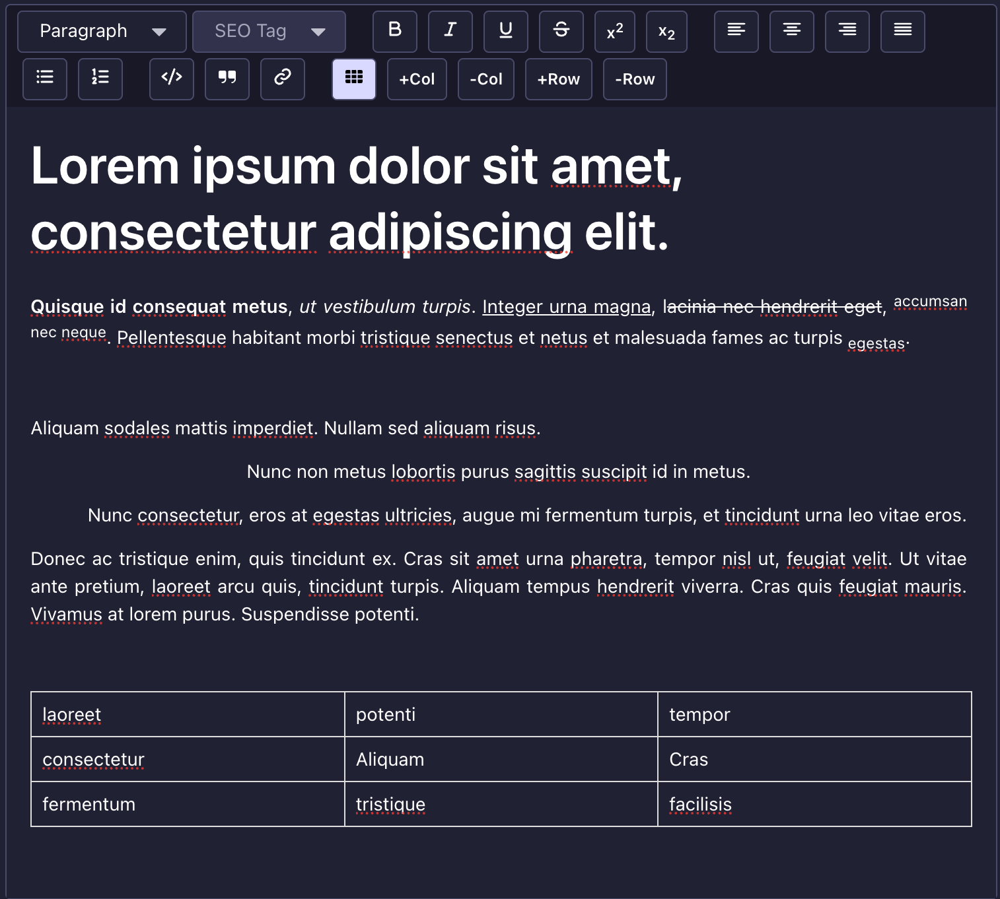

<div align="center">

  <picture >
  <!-- User has no color preference: -->
  
</picture>
  <h1>TipTap Editor Plugin for Strapi V5</h1>
  
  <p>
Enhance WYSIWYG experience in Strapi V5 with TipTap.
  </p>
  
  
<!-- Badges -->
<p>
  <a href="https://github.com/notum-cz/strapi-plugin-tiptap-editor/graphs/contributors">
    
  </a>
  <a href="">
    
  </a>
  <a href="https://github.com/notum-cz/strapi-plugin-tiptap-editor/issues/">
    
  </a>
  <a href="https://github.com/notum-cz/strapi-plugin-tiptap-editor/blob/main/LICENSE">
    
  </a>
</p>
   
<h4>
    <a href="https://github.com/notum-cz/strapi-plugin-tiptap-editor/issues/">Report Bug or Request Feature</a>
  
  </h4>
</div>

<br />

<!-- Table of Contents -->

# Table of Contents

- [Table of Contents](#table-of-contents)
  - [About the Project](#about-the-project)
    - [Features](#features)
    - [Screenshots](#screenshots)
    - [Supported Versions](#supported-versions)
  - [Getting Started](#getting-started)
    - [Installation](#installation)
      - [1. Install the plugin via npm or yarn](#1-install-the-plugin-via-npm-or-yarn)
      - [2. Rebuild Strapi and test the plugin](#2-rebuild-strapi-and-test-the-plugin)
  - [Roadmap](#roadmap)
  - [Community](#community)
    - [This plugin is maintained by Notum Technologies, a Czech-based Strapi Enterprise Partner.](#this-plugin-is-maintained-by-notum-technologies-a-czech-based-strapi-enterprise-partner)
      - [Current maintainer](#current-maintainer)
      - [Contributors](#contributors)
    - [How can Notum help you with your STRAPI project?](#how-can-notum-help-you-with-your-strapi-project)
    - [Contributing](#contributing)

<!-- About the Project -->

## About the Project

> [!IMPORTANT]
> This is an **initial release** of the plugin and it doesn't support all features, nor does it support **extensive configuration**. The first thing we will be adding is the ability to configure which features of TipTap you want to use in your Strapi instance.
>
> If you have any suggestions or feature requests, please don't hesitate to open an issue or submit a pull request.

<!-- Features -->

### Features

- Rich text editing with TipTap, a modern and extensible WYSIWYG editor built on ProseMirror.
- Seamless integration with Strapi's content management system.

<!-- Screenshots -->

### Screenshots

<div align="center"> 
  
</div>

<!-- Supported Versions -->

### Supported Versions

This plugin is compatible with Strapi `v5.x.x` and has been tested on Strapi `v5.34.0`. We expect it should also work on older version of Strapi V5.

<!-- Getting Started -->

## Getting Started

<!-- Installation -->

### Installation

#### 1. Install the plugin via npm or yarn

```bash
# NPM
npm i @notum-cz/strapi-plugin-tiptap-editor

# Yarn
yarn add @notum-cz/strapi-plugin-tiptap-editor

```

#### 2. Rebuild Strapi and test the plugin

```bash
  yarn build
  yarn start
```

<!-- Roadmap -->

## Roadmap

We're open to feedback and feature requests. Our current roadmap includes:

- [ ] Q2 2026: Add support for configuring which TipTap features to use in Strapi.

<!-- Contributing -->

## Community

### This plugin is maintained by [Notum Technologies](https://notum.tech), a Czech-based Strapi Enterprise Partner.

We're a software agency specializing in custom solutions based on Strapi. We're passionate about sharing our expertise with the open-source community.

This plugin is overseen by Ondřej Jánošík and it has been originally developed by [Ivo Pisařovic](https://github.com/ivopisarovic) and [Dominik Juriga](https://github.com/dominik-juriga).

#### Current maintainer

[Dominik Juriga](https://github.com/dominik-juriga)

#### Contributors

This plugin has been brought to you thanks to the following contributors:

<a href="https://github.com/notum-cz/strapi-plugin-tiptap-editor/graphs/contributors">
  
</a>

### [How can Notum help you with your STRAPI project?](https://www.notum.tech/notum-and-strapi)

✔️ We offer valuable assistance in developing custom STRAPI, web, and mobile apps to fulfill your requirements and goals.. <br>
✔️ With a track record of 100+ projects, our open communication and exceptional project management skills provide us with the necessary tools to get your project across the finish line.<br>

To initiate a discussion about your Strapi project, feel free to reach out to us via email at sales@notum.cz. We're here to assist you!

### Contributing

Contributions are always welcome! Please follow these steps to contribute:

1. Fork the Project
2. Create your Feature Branch (`git checkout -b feature/AmazingFeature`)
3. Commit your Changes (`git commit -m 'Add some AmazingFeature'`)
4. Push to the Branch (`git push origin feature/AmazingFeature`)
5. Open a Pull Request
